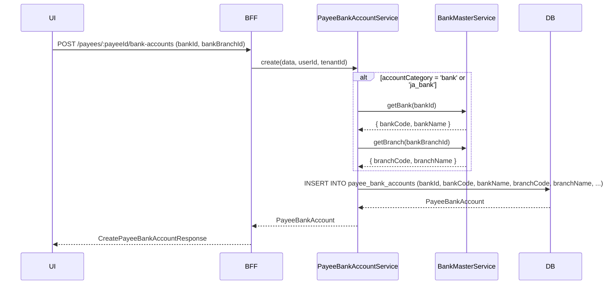

# Technical Design Document

## Feature
`master-data/business-partner`

## Overview

本ドキュメントは、ProcureERP購買管理SaaSにおける取引先系マスタ（Business Partner Master）の技術設計を定義する。

取引先系マスタは、購買・販売業務の基盤となる5つのエンティティ（Party, SupplierSite, Payee, CustomerSite, ShipTo）を管理する。既存の employee-master 実装パターンを踏襲しつつ、エンティティ間の複雑な関係（Partyを親とするSite階層、Payee自動生成、派生フラグ管理）を考慮した設計とする。

主要な技術的特徴：
- **Contracts-first**: BFF/API 契約を先行定義し、UI/Backend 実装が契約に従う
- **Multi-entity management**: 5エンティティを独立したServiceで管理しつつ、Service間連携でビジネスルールを実現
- **Code normalization**: 業務コード（10桁）の入力正規化（trim・半角化・大文字統一）
- **Derived flags management**: is_supplier/is_customer フラグをService層で明示的に更新
- **Payee auto-generation**: SupplierSite作成時に既存Payeeを再利用または新規作成

---

## Architecture

### Architecture Pattern & Boundary Map

**Pattern (fixed)**:
- UI（apps/web） → BFF（apps/bff） → Domain API（apps/api） → DB（PostgreSQL + RLS）
- UI直APIは禁止

**Contracts (SSoT)**:
- UI ↔ BFF: `packages/contracts/src/bff/business-partner`
- BFF ↔ Domain API: `packages/contracts/src/api/business-partner`
- Enum/Error: `packages/contracts/src/api/errors/business-partner-error.ts`
- UI は `packages/contracts/src/api` を参照してはならない

**Boundary Enforcement**:
- BFF: UI入力の正規化（paging/sorting/filtering）、Domain API DTO ⇄ UI DTO の変換
- Domain API: ビジネスルールの正本（Payee自動生成、派生フラグ更新、コード正規化）
- Repository: tenant_id double-guard（アプリ層 WHERE句 + RLS）

---

## Architecture Responsibilities

### BFF Specification（apps/bff）

**Purpose**
- UI要件に最適化したAPI（Read Model / ViewModel）
- Domain APIのレスポンスを集約・変換（ビジネスルールの正本は持たない）

**BFF Endpoints（UIが叩く）**

| Method | Endpoint | Purpose | Request DTO | Response DTO | Notes |
| ------ | -------- | ------- | ----------- | ------------ | ----- |
| GET | `/api/bff/master-data/business-partner/parties` | Party一覧取得 | ListPartiesRequest | ListPartiesResponse | keyword検索、is_supplier/is_customerフィルタ対応 |
| GET | `/api/bff/master-data/business-partner/parties/:id` | Party詳細取得 | - | GetPartyResponse | - |
| POST | `/api/bff/master-data/business-partner/parties` | Party新規登録 | CreatePartyRequest | CreatePartyResponse | - |
| PUT | `/api/bff/master-data/business-partner/parties/:id` | Party更新 | UpdatePartyRequest | UpdatePartyResponse | version（楽観ロック）必須 |
| GET | `/api/bff/master-data/business-partner/supplier-sites` | SupplierSite一覧取得 | ListSupplierSitesRequest | ListSupplierSitesResponse | party_id フィルタ対応 |
| GET | `/api/bff/master-data/business-partner/supplier-sites/:id` | SupplierSite詳細取得 | - | GetSupplierSiteResponse | - |
| POST | `/api/bff/master-data/business-partner/supplier-sites` | SupplierSite新規登録 | CreateSupplierSiteRequest | CreateSupplierSiteResponse | payeeIdオプション（未指定時自動生成） |
| PUT | `/api/bff/master-data/business-partner/supplier-sites/:id` | SupplierSite更新 | UpdateSupplierSiteRequest | UpdateSupplierSiteResponse | version（楽観ロック）必須 |
| GET | `/api/bff/master-data/business-partner/payees` | Payee一覧取得 | ListPayeesRequest | ListPayeesResponse | party_id フィルタ対応 |
| GET | `/api/bff/master-data/business-partner/payees/:id` | Payee詳細取得 | - | GetPayeeResponse | - |
| POST | `/api/bff/master-data/business-partner/payees` | Payee新規登録 | CreatePayeeRequest | CreatePayeeResponse | - |
| PUT | `/api/bff/master-data/business-partner/payees/:id` | Payee更新 | UpdatePayeeRequest | UpdatePayeeResponse | version（楽観ロック）必須 |
| GET | `/api/bff/master-data/business-partner/customer-sites` | CustomerSite一覧取得 | ListCustomerSitesRequest | ListCustomerSitesResponse | 将来拡張（MVP-1では未実装） |
| GET | `/api/bff/master-data/business-partner/ship-tos` | ShipTo一覧取得 | ListShipTosRequest | ListShipTosResponse | 将来拡張（MVP-1では未実装） |
| GET | `/api/bff/master-data/business-partner/payees/:payeeId/bank-accounts` | PayeeBankAccount一覧取得 | ListPayeeBankAccountsRequest | ListPayeeBankAccountsResponse | payeeId でフィルタ |
| POST | `/api/bff/master-data/business-partner/payees/:payeeId/bank-accounts` | PayeeBankAccount新規登録 | CreatePayeeBankAccountRequest | CreatePayeeBankAccountResponse | 銀行マスタ連携 |
| PUT | `/api/bff/master-data/business-partner/payee-bank-accounts/:id` | PayeeBankAccount更新 | UpdatePayeeBankAccountRequest | UpdatePayeeBankAccountResponse | version（楽観ロック）必須 |
| GET | `/api/bff/master-data/business-partner/banks/search` | 銀行検索（サジェスト用） | SearchBanksRequest | SearchBanksResponse | キーワード検索（銀行コード/銀行名） |
| GET | `/api/bff/master-data/business-partner/banks/:bankId/branches/search` | 支店検索（サジェスト用） | SearchBranchesRequest | SearchBranchesResponse | bankId必須、キーワード検索 |
| GET | `/api/bff/master-data/business-partner/company-bank-accounts` | 自社口座一覧取得 | ListCompanyBankAccountsRequest | ListCompanyBankAccountsResponse | isActive=trueのみ、Payee出金口座選択用 |

**Naming Convention（必須）**
- DTO / Contracts: camelCase（例: `partyCode`, `partyName`, `supplierCode`）
- DB columns: snake_case（例: `party_code`, `party_name`, `supplier_code`）
- `sortBy` は **DTO側キー**を採用する（例: `partyCode | partyName | supplierCode`）
- DB列名（snake_case）を UI/BFF へ露出させない

**Paging / Sorting Normalization（必須・BFF責務）**
- UI/BFF: page / pageSize（page-based, 1-based）
- Domain API: offset / limit（DB-friendly, 0-based）
- BFFは必ず以下を実施する（省略禁止）：
  - defaults: page=1, pageSize=50, sortBy=<default>, sortOrder=asc
  - clamp: pageSize <= 200
  - whitelist: sortBy は許可リストのみ（設計で明記）
    - Party: `partyCode | partyName | partyNameKana | isSupplier | isCustomer | isActive`
    - SupplierSite: `supplierCode | supplierName | supplierNameKana | isActive`
    - Payee: `payeeCode | payeeName | payeeNameKana | isActive`
  - normalize: keyword trim、空→undefined
  - transform: offset=(page-1)*pageSize, limit=pageSize
- Domain APIに渡すのは offset/limit（page/pageSizeは渡さない）
- BFFレスポンスには page/pageSize/total/totalPages を含める（UIへ返すのはBFF側の値）

**Transformation Rules（api DTO → bff DTO）**
- 方針: field rename は行わない（BFF DTO = API DTO の構造を踏襲）
- SupplierSiteApiDto → SupplierSiteDto: フィールドそのまま
- PayeeApiDto → PayeeDto: フィールドそのまま
- ListResponse: page/pageSize/total/totalPages を追加（APIは total のみ）

**Error Handling（contracts errorに準拠）**

**Error Policy（必須・未記載禁止）**
- この Feature における BFF の Error Policy は以下とする：
  - 採用方針: **Option A: Pass-through**
  - 採用理由: employee-master と同様、Domain APIのエラーを原則そのまま返す。UIは `contracts/bff/errors` に基づいて表示制御を行うため、BFF側での意味的な再分類は不要。責務境界を明確化。

**Option A: Pass-through（採用）**
- Domain APIのエラーを原則そのまま返す（status / code / message / details）
- BFF側での意味的な再分類・書き換えは禁止（ログ付与等の非機能は除く）
- UIは `contracts/bff/errors` に基づいて表示制御を行う

**In all cases**
- 最終拒否権限（403/404/409/422等）は Domain API が持つ

**Authentication / Tenant Context（tenant_id/user_id伝搬）**
- BFF は認証情報（Clerkトークン）から `tenant_id` / `user_id` を解決
- Domain API 呼び出し時に HTTP Header で伝搬（`x-tenant-id`, `x-user-id`）
- Domain API は Header から tenant_id/user_id を取得し、RLS設定 + Repository引数として利用

---

### Service Specification（Domain / apps/api）

**Purpose**
- Domainがビジネスルールの正本（BFF/UIは禁止）
- Transaction boundary / audit points を明記

**Services（Entity単位）**

| Service | Purpose | Key Responsibilities | Transaction Boundary |
| ------- | ------- | -------------------- | -------------------- |
| PartyService | Party（取引先法人）の CRUD | party_code 正規化、重複チェック、is_supplier/is_customer 派生フラグ更新 | create/update 単位 |
| SupplierSiteService | SupplierSite（仕入先拠点）の CRUD | supplier_code 生成、Payee 自動生成・紐づけ、Party の is_supplier フラグ更新 | create（SupplierSite + Payee）/ update 単位 |
| PayeeService | Payee（支払先）の CRUD | payee_code 生成、重複チェック | create/update 単位 |
| CustomerSiteService | CustomerSite（得意先拠点）の CRUD（MVP-1未実装） | customer_code 生成、Party の is_customer フラグ更新 | create/update 単位 |
| ShipToService | ShipTo（納入先）の CRUD（MVP-1未実装） | ship_to_code 正規化、重複チェック | create/update 単位 |

**Service Responsibilities（詳細）**

**PartyService**:
- party_code 正規化（normalizeBusinessCode ユーティリティ利用）
- party_code 重複チェック（UNIQUE制約違反 → PARTY_CODE_DUPLICATE）
- is_supplier/is_customer 派生フラグの更新（SupplierSite/CustomerSite 作成・削除時に呼び出される）
- 監査列（created_by_login_account_id / updated_by_login_account_id）への user_id 設定
- 楽観ロック（version）による競合検出

**SupplierSiteService**:
- supplier_sub_code 正規化（normalizeBusinessCode ユーティリティ利用）
- supplier_code 自動生成（`party_code + "-" + supplier_sub_code`）
- UNIQUE(tenant_id, party_id, supplier_sub_code) 重複チェック
- Payee 自動生成・紐づけロジック（Requirement 2.6-2.8, 2.11）：
  1. payee_id 未指定の場合、PayeeService.findOrCreate を呼び出す
  2. findOrCreate は同一 party_id + supplier_sub_code のPayeeを検索
  3. 存在すれば既存Payeeの id を返す
  4. 存在しなければ新規Payee作成（payee_sub_code = supplier_sub_code）、住所・連絡先・名称を初回コピー
- SupplierSite 作成時に PartyService.updateDerivedFlags を呼び出し、is_supplier = true に更新
- SupplierSite 論理削除時に PartyService.updateDerivedFlags を呼び出し、同一Party配下に有効なSupplierSiteが残っていなければ is_supplier = false に更新
- 監査列への user_id 設定
- 楽観ロック（version）による競合検出

**PayeeService**:
- payee_sub_code 正規化（normalizeBusinessCode ユーティリティ利用）
- payee_code 自動生成（`party_code + "-" + payee_sub_code`）
- UNIQUE(tenant_id, party_id, payee_sub_code) 重複チェック
- findOrCreate メソッド提供（SupplierSiteService から呼び出される）
- 監査列への user_id 設定
- 楽観ロック（version）による競合検出

**Audit Points（監査ログ対象）**:
- Party / SupplierSite / Payee の作成・更新・論理削除
- created_by_login_account_id / updated_by_login_account_id に user_id を必ず設定（アプリ層で実質必須）

**Business Rules Implementation**:
- コード正規化: `normalizeBusinessCode(code: string, mode: 'numeric' | 'alphanumeric'): string`
  - trim（前後空白除去）
  - 全角→半角変換
  - 英数字モード時は英字を大文字に統一
  - 正規化後に 10桁チェック（違反時は INVALID_CODE_LENGTH エラー）
- Payee自動生成: `PayeeService.findOrCreate(params: { tenantId, partyId, payeeSubCode, ... }): Promise<{ payeeId }>`
  - 同一 party_id + payee_sub_code の Payee を検索
  - 存在すれば payeeId を返す
  - 存在しなければ新規作成（住所・連絡先・名称をコピー）して payeeId を返す
- 派生フラグ更新: `PartyService.updateDerivedFlags(params: { tenantId, partyId }): Promise<void>`
  - 同一Party配下の有効な SupplierSite/CustomerSite 件数をカウント
  - is_supplier = (SupplierSite件数 > 0)
  - is_customer = (CustomerSite件数 > 0)
  - Party を更新

---

### Repository Specification（apps/api）

**Purpose**
- DBアクセスの唯一の窓口
- tenant_id 必須（全メソッド）
- where句二重ガード必須（アプリ層 + RLS）

**Repositories**

| Repository | Table | Key Methods |
| ---------- | ----- | ----------- |
| PartyRepository | parties | findById, findByCode, list, create, update, countActiveSupplierSites, countActiveCustomerSites |
| SupplierSiteRepository | supplier_sites | findById, findByCode, list, create, update |
| PayeeRepository | payees | findById, findByCode, findByPartyAndSubCode, list, create, update |
| CustomerSiteRepository | customer_sites | findById, findByCode, list, create, update（MVP-1未実装） |
| ShipToRepository | ship_tos | findById, findByCode, list, create, update（MVP-1未実装） |

**Repository Rules（必須）**:
- すべてのメソッドで `tenantId: string` を引数に受け取る
- すべてのクエリの WHERE句に `tenant_id = ${tenantId}` を明示（double-guard）
- RLS設定を前提とする（`SET app.current_tenant_id = '${tenantId}'` を接続時に実行）
- tenant_id を含まないクエリは禁止（例外: 全テナント共通マスタのみ許可、要ADR）

**Key Methods（例: PartyRepository）**:
- `findById(tenantId: string, id: string): Promise<Party | null>`
- `findByCode(tenantId: string, partyCode: string): Promise<Party | null>`
- `list(tenantId: string, params: { offset, limit, sortBy, sortOrder, keyword?, isSupplier?, isCustomer? }): Promise<{ items, total }>`
- `create(tenantId: string, data: CreatePartyData): Promise<Party>`
- `update(tenantId: string, id: string, version: number, data: UpdatePartyData): Promise<Party>`
- `countActiveSupplierSites(tenantId: string, partyId: string): Promise<number>`
- `countActiveCustomerSites(tenantId: string, partyId: string): Promise<number>`

---

### Contracts Summary（This Feature）

**Contracts Location**:
- BFF Contracts: `packages/contracts/src/bff/business-partner/index.ts`
- API Contracts: `packages/contracts/src/api/business-partner/index.ts`
- Error Definitions: `packages/contracts/src/api/errors/business-partner-error.ts`
- Error Export: `packages/contracts/src/api/errors/index.ts` に export 追加

**DTO Naming Convention（必須）**:
- すべて camelCase（例: `partyCode`, `supplierSubCode`, `payeeCode`）
- DB列名（snake_case）を DTO に露出させない

**Error Codes（定義必須）**:
```typescript
export const BusinessPartnerErrorCode = {
  // Party
  PARTY_NOT_FOUND: 'PARTY_NOT_FOUND', // 404
  PARTY_CODE_DUPLICATE: 'PARTY_CODE_DUPLICATE', // 409

  // SupplierSite
  SUPPLIER_SITE_NOT_FOUND: 'SUPPLIER_SITE_NOT_FOUND', // 404
  SUPPLIER_CODE_DUPLICATE: 'SUPPLIER_CODE_DUPLICATE', // 409

  // Payee
  PAYEE_NOT_FOUND: 'PAYEE_NOT_FOUND', // 404
  PAYEE_CODE_DUPLICATE: 'PAYEE_CODE_DUPLICATE', // 409

  // CustomerSite
  CUSTOMER_SITE_NOT_FOUND: 'CUSTOMER_SITE_NOT_FOUND', // 404
  CUSTOMER_CODE_DUPLICATE: 'CUSTOMER_CODE_DUPLICATE', // 409

  // ShipTo
  SHIP_TO_NOT_FOUND: 'SHIP_TO_NOT_FOUND', // 404
  SHIP_TO_CODE_DUPLICATE: 'SHIP_TO_CODE_DUPLICATE', // 409

  // PayeeBankAccount
  PAYEE_BANK_ACCOUNT_NOT_FOUND: 'PAYEE_BANK_ACCOUNT_NOT_FOUND', // 404
  BANK_NOT_FOUND: 'BANK_NOT_FOUND', // 404 (銀行マスタ参照エラー)
  BANK_BRANCH_NOT_FOUND: 'BANK_BRANCH_NOT_FOUND', // 404 (支店マスタ参照エラー)

  // Common
  INVALID_CODE_LENGTH: 'INVALID_CODE_LENGTH', // 422
  REQUIRED_FIELD_MISSING: 'REQUIRED_FIELD_MISSING', // 422
  CONCURRENT_UPDATE: 'CONCURRENT_UPDATE', // 409
} as const;
```

**Enum/Error 配置**:
- Error は原則 `packages/contracts/src/api/errors/*` に集約
- Enum（PaymentMethod, CurrencyCode 等）は `packages/contracts/src/shared/enums/*` に集約（将来拡張）

---

## Responsibility Clarification

本Featureにおける責務境界を以下に明記する。未記載の責務は実装してはならない。

### UIの責務
- 表示制御（enable/disable / 文言切替）
- フォーム入力制御・UX最適化（例: Payee選択UIの3択表示）
- ビジネス判断は禁止（例: Payee自動生成の可否判定はUI側で行わない）

### BFFの責務
- UI入力の正規化（paging: page/pageSize → offset/limit, sorting, filtering）
- Domain API DTO ⇄ UI DTO の変換（本Featureでは構造同一のため実質パススルー）
- エラーの透過（Pass-through方針）
- ビジネスルールの正本は持たない

### Domain APIの責務
- ビジネスルールの正本（コード正規化、Payee自動生成、派生フラグ更新）
- 権限・状態遷移の最終判断（is_active=false は新規選択不可）
- 監査ログ・整合性保証（created_by/updated_by 必須設定）
- トランザクション境界の管理（SupplierSite + Payee 作成を1トランザクション）

---

## Requirements Traceability

| Requirement | Summary | Components | Interfaces | Flows |
| ----------- | ------- | ---------- | ---------- | ----- |
| 1.1-1.10 | Party（取引先法人）マスタ管理 | PartyService, PartyRepository, PartyController | BFF: ListPartiesRequest/Response, CreatePartyRequest/Response, UpdatePartyRequest/Response | - |
| 2.1-2.11 | SupplierSite（仕入先拠点）マスタ管理 | SupplierSiteService, SupplierSiteRepository, PayeeService, PartyService | BFF: ListSupplierSitesRequest/Response, CreateSupplierSiteRequest/Response | Payee Auto-generation Flow |
| 3.1-3.8 | Payee（支払先）マスタ管理 | PayeeService, PayeeRepository | BFF: ListPayeesRequest/Response, CreatePayeeRequest/Response | - |
| 4.1-4.7 | CustomerSite（得意先拠点）マスタ管理【将来拡張】 | CustomerSiteService, CustomerSiteRepository（MVP-1未実装） | - | - |
| 5.1-5.6 | ShipTo（納入先）マスタ管理 | ShipToService, ShipToRepository（MVP-1未実装） | - | - |
| 6.1-6.6 | コード正規化・バリデーション | normalizeBusinessCode（共通ユーティリティ） | - | - |
| 7.1-7.6 | 派生フラグ（is_supplier/is_customer）管理 | PartyService.updateDerivedFlags | - | Derived Flag Update Flow |
| 8.1-8.5 | 監査列・トレーサビリティ | 全Service（created_by/updated_by 設定） | - | - |
| 9.1-9.5 | マルチテナント分離・RLS | 全Repository（tenant_id double-guard） | - | - |
| 10.1-10.4 | 論理削除・参照整合 | 全Service（is_active=false 制御） | - | - |
| 11.1-11.4 | 楽観ロック（version） | 全Service（version チェック） | - | - |
| 12.1-12.5 | 一覧取得・検索・ソート | BFF Paging正規化、Repository list メソッド | - | - |
| 13.1-13.4 | Payee自動生成UI統合 | UI（Payee選択3択）、SupplierSiteService | - | Payee Auto-generation Flow |
| 14.1-14.5 | エラーハンドリング・ユーザーフィードバック | 全Service（エラーコード返却） | BusinessPartnerErrorCode | - |
| 15.1-15.10 | 支払先口座（PayeeBankAccount）マスタ管理 | PayeeBankAccountService, PayeeBankAccountRepository, BankSearchController | BFF: ListPayeeBankAccountsRequest/Response, CreatePayeeBankAccountRequest/Response, SearchBanksRequest/Response, SearchBranchesRequest/Response | Bank Master Integration Flow |
| 16.1-16.6 | 支払先デフォルト出金口座設定 | PayeeService, PayeeRepository, CompanyBankAccountBffService | BFF: ListCompanyBankAccountsRequest/Response, PayeeDto (defaultCompanyBankAccountId追加) | - |

---

## UI Design

### PayeeDialog 振込口座セクション（銀行マスタ連携）

**Intent**: 支払先（Payee）登録画面内で振込口座情報を銀行マスタと連携して入力

**UI構造**:
```
┌─ PayeeDialog ─────────────────────────────────────────────────┐
│  [支払先基本情報セクション]                                       │
│  ...                                                           │
│                                                                │
│  ┌─ 振込口座セクション ────────────────────────────────────────┐ │
│  │                                                            │ │
│  │  口座区分: [銀行 ▼] [ゆうちょ] [農協]   (RadioGroup)        │ │
│  │                                                            │ │
│  │  ── 銀行・農協選択時 ────────────────────────────────────  │ │
│  │  銀行: [         🔍] (サジェスト入力)                       │ │
│  │        → 入力中: "みずほ" → [みずほ銀行 (0001)] 候補表示     │ │
│  │        → 選択後: "みずほ銀行 (0001)" + 🔒(bankId保持)        │ │
│  │                                                            │ │
│  │  支店: [         🔍] (サジェスト入力、銀行選択後有効化)       │ │
│  │        → 入力中: "東京営業" → [東京営業部 (001)] 候補表示    │ │
│  │        → 選択後: "東京営業部 (001)" + 🔒(branchId保持)       │ │
│  │                                                            │ │
│  │  ── ゆうちょ選択時 ─────────────────────────────────────   │ │
│  │  記号: [      ] (5桁数字)                                   │ │
│  │  番号: [        ] (8桁以内数字)                             │ │
│  │                                                            │ │
│  │  ── 共通 ───────────────────────────────────────────────  │ │
│  │  口座種別: [普通 ▼]  口座番号: [        ]                   │ │
│  │  口座名義: [                  ]                             │ │
│  │  口座名義（カナ）: [                  ]                      │ │
│  │  振込手数料負担: (●) 当方負担  ( ) 先方負担                  │ │
│  │  備考: [                                        ]           │ │
│  │                                                            │ │
│  └────────────────────────────────────────────────────────────┘ │
│                                                                │
│  [キャンセル]                                    [保存]         │
└────────────────────────────────────────────────────────────────┘
```

**UI Components**:

| Component | Type | Description |
| --------- | ---- | ----------- |
| AccountCategorySelector | RadioGroup | 口座区分の選択（銀行/ゆうちょ/農協） |
| BankSuggestInput | Combobox | 銀行名/コードによるサジェスト検索・選択 |
| BranchSuggestInput | Combobox | 支店名/コードによるサジェスト検索・選択（銀行選択後有効化） |
| PostOfficeInput | Input x2 | ゆうちょ記号・番号入力 |
| AccountTypeSelect | Select | 口座種別（普通/当座/貯蓄/その他） |
| AccountNoInput | Input | 口座番号入力 |
| AccountHolderInput | Input x2 | 口座名義・カナ入力 |
| TransferFeeBearerRadio | RadioGroup | 振込手数料負担者選択 |

**Interaction Flow**:

1. **口座区分選択**:
   - 「銀行」「農協」選択時 → 銀行・支店サジェスト入力を表示
   - 「ゆうちょ」選択時 → 記号・番号入力を表示

2. **銀行サジェスト入力**:
   - 2文字以上入力で API 呼び出し（debounce 300ms）
   - `GET /api/bff/master-data/business-partner/banks/search?keyword={入力値}`
   - 検索結果をドロップダウン表示（最大10件）
   - 候補選択時に `bankId` を内部保持、表示は「銀行名 (銀行コード)」

3. **支店サジェスト入力**:
   - 銀行未選択時は disabled
   - 銀行選択後に有効化、2文字以上入力で API 呼び出し
   - `GET /api/bff/master-data/business-partner/banks/{bankId}/branches/search?keyword={入力値}`
   - 候補選択時に `bankBranchId` を内部保持

4. **フォーム送信**:
   - 銀行・支店の `id` を送信（コード・名称は API 側で解決）
   - Request: `{ payeeId, accountCategory: 'bank', bankId, bankBranchId, accountType, accountNo, ... }`

**State Management（React Hook Form）**:
```typescript
interface PayeeBankAccountFormData {
  accountCategory: 'bank' | 'post_office' | 'ja_bank';
  bankId: string | null;           // 銀行マスタから選択したID
  bankDisplayValue: string;        // 表示用（銀行名 + コード）
  bankBranchId: string | null;     // 支店マスタから選択したID
  branchDisplayValue: string;      // 表示用（支店名 + コード）
  postOfficeSymbol: string;        // ゆうちょ記号
  postOfficeNumber: string;        // ゆうちょ番号
  accountType: 'ordinary' | 'current' | 'savings' | 'other';
  accountNo: string;
  accountHolderName: string;
  accountHolderNameKana: string;
  transferFeeBearer: 'sender' | 'recipient';
  notes: string;
}
```

**Validation Rules**:
- 口座区分が銀行/農協の場合: bankId, bankBranchId 必須
- 口座区分がゆうちょの場合: postOfficeSymbol（5桁）, postOfficeNumber（8桁以内）必須
- 口座名義: 必須
- 振込手数料負担: 必須

**Error Handling（UI）**:
- BANK_NOT_FOUND → 「選択した銀行が見つかりません。再度検索してください」
- BANK_BRANCH_NOT_FOUND → 「選択した支店が見つかりません。再度検索してください」
- PAYEE_BANK_ACCOUNT_NOT_FOUND → 「口座情報が見つかりません」

---

### PayeeDialog デフォルト出金口座セクション（Requirement 16）

**Intent**: 支払先（Payee）に対して、支払時にデフォルトで使用する自社口座（出金口座）を設定

**UI構造**:
```
┌─ PayeeDialog ─────────────────────────────────────────────────┐
│  [支払先基本情報セクション]                                       │
│  ...                                                           │
│                                                                │
│  ┌─ 支払設定セクション ─────────────────────────────────────────┐ │
│  │                                                            │ │
│  │  支払方法: [銀行振込 ▼]                                     │ │
│  │  通貨: [JPY ▼]                                             │ │
│  │  支払条件: [月末締め翌月末払い            ]                   │ │
│  │                                                            │ │
│  │  デフォルト出金口座: [                          ▼]          │ │
│  │    └─ ドロップダウン候補:                                   │ │
│  │        [（未設定）]                                         │ │
│  │        [みずほ銀行 東京営業部 普通 1234567 本社口座]         │ │
│  │        [三井住友銀行 新宿支店 普通 7654321 工場口座]         │ │
│  │                                                            │ │
│  └────────────────────────────────────────────────────────────┘ │
│                                                                │
│  [振込口座セクション]（支払先の口座）                              │
│  ...                                                           │
│                                                                │
│  [キャンセル]                                    [保存]         │
└────────────────────────────────────────────────────────────────┘
```

**UI Components**:

| Component | Type | Description |
| --------- | ---- | ----------- |
| CompanyBankAccountSelect | Select | 自社口座マスタからの選択。isActive=trueのみ表示 |

**Data Flow**:

1. **一覧取得**:
   - PayeeDialog マウント時に `GET /api/bff/master-data/business-partner/company-bank-accounts` 呼び出し
   - isActive=true の自社口座一覧を取得
   - ドロップダウン候補として表示

2. **表示形式**:
   - `{銀行名} {支店名} {口座種別} {口座番号} {口座名称}`
   - 例: `みずほ銀行 東京営業部 普通 1234567 本社口座`

3. **保存**:
   - Payee 登録/更新時に `defaultCompanyBankAccountId` を送信
   - 未選択の場合は null

**State Management**:
```typescript
interface PayeeFormData {
  // ... 既存フィールド
  defaultCompanyBankAccountId: string | null;  // 選択した自社口座ID
}
```

**Validation Rules**:
- defaultCompanyBankAccountId は NULL許容（未設定可）
- 選択された口座が isActive=false の場合はエラー表示

---

## System Flows

### Payee Auto-generation Flow（Requirement 2.6-2.11, 13.1-13.4）

```mermaid
sequenceDiagram
    participant UI
    participant BFF
    participant SupplierSiteService
    participant PayeeService
    participant PartyService
    participant DB

    UI->>BFF: POST /supplier-sites (payeeId未指定)
    BFF->>SupplierSiteService: create(data, userId, tenantId)

    SupplierSiteService->>SupplierSiteService: normalizeBusinessCode(supplier_sub_code)
    SupplierSiteService->>SupplierSiteService: 生成 supplier_code = party_code + "-" + supplier_sub_code

    SupplierSiteService->>PayeeService: findOrCreate(tenantId, partyId, payeeSubCode, ...)
    PayeeService->>DB: SELECT payees WHERE tenant_id=? AND party_id=? AND payee_sub_code=?

    alt 既存Payee存在
        DB-->>PayeeService: Payee（既存）
        PayeeService-->>SupplierSiteService: { payeeId }
    else 既存Payee不在
        PayeeService->>PayeeService: normalizeBusinessCode(payee_sub_code)
        PayeeService->>PayeeService: 生成 payee_code = party_code + "-" + payee_sub_code
        PayeeService->>DB: INSERT INTO payees (住所・連絡先・名称をSupplierSiteからコピー)
        DB-->>PayeeService: Payee（新規）
        PayeeService-->>SupplierSiteService: { payeeId }
    end

    SupplierSiteService->>DB: INSERT INTO supplier_sites (payee_id=payeeId)
    SupplierSiteService->>PartyService: updateDerivedFlags(tenantId, partyId)
    PartyService->>DB: SELECT COUNT(*) FROM supplier_sites WHERE party_id=? AND is_active=true
    PartyService->>DB: UPDATE parties SET is_supplier=true WHERE id=partyId

    SupplierSiteService-->>BFF: SupplierSite（作成済み）
    BFF-->>UI: CreateSupplierSiteResponse
```



### Derived Flag Update Flow（Requirement 7.1-7.6）

```mermaid
sequenceDiagram
    participant Service as SupplierSite/CustomerSite Service
    participant PartyService
    participant DB

    alt SupplierSite/CustomerSite 作成時
        Service->>DB: INSERT INTO supplier_sites / customer_sites
        Service->>PartyService: updateDerivedFlags(tenantId, partyId)
        PartyService->>DB: SELECT COUNT(*) FROM supplier_sites WHERE party_id=? AND is_active=true
        PartyService->>DB: SELECT COUNT(*) FROM customer_sites WHERE party_id=? AND is_active=true
        PartyService->>PartyService: is_supplier = (supplier_sites_count > 0)
        PartyService->>PartyService: is_customer = (customer_sites_count > 0)
        PartyService->>DB: UPDATE parties SET is_supplier=?, is_customer=? WHERE id=partyId
    end

    alt SupplierSite/CustomerSite 論理削除時
        Service->>DB: UPDATE supplier_sites / customer_sites SET is_active=false
        Service->>PartyService: updateDerivedFlags(tenantId, partyId)
        PartyService->>DB: SELECT COUNT(*) FROM supplier_sites WHERE party_id=? AND is_active=true
        PartyService->>DB: SELECT COUNT(*) FROM customer_sites WHERE party_id=? AND is_active=true
        PartyService->>PartyService: is_supplier = (supplier_sites_count > 0)
        PartyService->>PartyService: is_customer = (customer_sites_count > 0)
        PartyService->>DB: UPDATE parties SET is_supplier=?, is_customer=? WHERE id=partyId
    end
```



---

## Components & Interface Contracts

### Component Summary Table

| Component | Domain | Intent | Requirements | Dependencies | Contracts |
| --------- | ------ | ------ | ------------ | ------------ | --------- |
| PartyController | master-data | Party CRUD API提供 | 1.1-1.10 | PartyService | Service: ☑, API: ☑ |
| PartyService | master-data | Party ビジネスロジック | 1.1-1.10, 7.1-7.6 | PartyRepository, normalizeBusinessCode | Service: ☑ |
| PartyRepository | master-data | Party DBアクセス | 1.1-1.10, 9.1-9.5 | Prisma | - |
| SupplierSiteController | master-data | SupplierSite CRUD API提供 | 2.1-2.11 | SupplierSiteService | Service: ☑, API: ☑ |
| SupplierSiteService | master-data | SupplierSite ビジネスロジック、Payee自動生成 | 2.1-2.11, 13.1-13.4 | SupplierSiteRepository, PayeeService, PartyService, normalizeBusinessCode | Service: ☑ |
| SupplierSiteRepository | master-data | SupplierSite DBアクセス | 2.1-2.11, 9.1-9.5 | Prisma | - |
| PayeeController | master-data | Payee CRUD API提供 | 3.1-3.8 | PayeeService | Service: ☑, API: ☑ |
| PayeeService | master-data | Payee ビジネスロジック、findOrCreate提供 | 3.1-3.8 | PayeeRepository, normalizeBusinessCode | Service: ☑ |
| PayeeRepository | master-data | Payee DBアクセス | 3.1-3.8, 9.1-9.5 | Prisma | - |
| BFF Controller | bff | UI向けエンドポイント提供 | 12.1-12.5 | Domain API Client | Service: ☑, API: ☑ |
| BFF Service | bff | Paging正規化、DTO変換 | 12.1-12.5 | Domain API Client | Service: ☑ |
| normalizeBusinessCode | common/utils | コード正規化ユーティリティ | 6.1-6.6 | - | - |
| PayeeBankAccountController | master-data | PayeeBankAccount CRUD API提供 | 15.1-15.10 | PayeeBankAccountService | Service: ☑, API: ☑ |
| PayeeBankAccountService | master-data | PayeeBankAccount ビジネスロジック、銀行マスタ連携 | 15.1-15.10 | PayeeBankAccountRepository, BankMasterService | Service: ☑ |
| PayeeBankAccountRepository | master-data | PayeeBankAccount DBアクセス | 15.1-15.10, 9.1-9.5 | Prisma | - |
| BankSearchController | bff | 銀行・支店サジェスト検索API | 15.4-15.6 | BankMasterAPI Client | Service: ☑, API: ☑ |

### Dependencies Table

| Component | Dependency | Type | Criticality | Notes |
| --------- | ---------- | ---- | ----------- | ----- |
| SupplierSiteService | PayeeService | Inbound | P0 | Payee自動生成のため必須 |
| SupplierSiteService | PartyService | Inbound | P0 | is_supplier フラグ更新のため必須 |
| All Services | normalizeBusinessCode | Inbound | P0 | コード正規化のため必須 |
| All Repositories | Prisma | External | P0 | ORM |
| BFF | Domain API | External | P0 | HTTP Client経由 |
| PayeeBankAccountService | BankMasterService | External | P0 | 銀行・支店情報取得のため必須 |
| BankSearchController | BankMasterAPI | External | P0 | サジェスト検索のため必須 |

---

### PartyController（Domain API）

**Intent**: Party（取引先法人）の CRUD API を提供

**Service Interface**:
```typescript
interface IPartyService {
  list(params: ListPartiesParams): Promise<{ items: Party[], total: number }>;
  getById(id: string): Promise<Party>;
  create(data: CreatePartyData, userId: string): Promise<Party>;
  update(id: string, version: number, data: UpdatePartyData, userId: string): Promise<Party>;
  updateDerivedFlags(partyId: string): Promise<void>;
}

interface ListPartiesParams {
  tenantId: string;
  offset: number;
  limit: number;
  sortBy?: 'partyCode' | 'partyName' | 'partyNameKana' | 'isSupplier' | 'isCustomer' | 'isActive';
  sortOrder?: 'asc' | 'desc';
  keyword?: string;
  isSupplier?: boolean;
  isCustomer?: boolean;
}

interface CreatePartyData {
  tenantId: string;
  partyCode: string;
  partyName: string;
  partyNameKana?: string;
  // ... その他フィールド（エンティティ定義参照）
}

interface UpdatePartyData {
  partyName: string;
  partyNameKana?: string;
  // ... その他フィールド（party_code は変更不可）
}
```

**API Contracts**:
- Request: `ListPartiesApiRequest`, `CreatePartyApiRequest`, `UpdatePartyApiRequest`
- Response: `ListPartiesApiResponse`, `GetPartyApiResponse`, `CreatePartyApiResponse`, `UpdatePartyApiResponse`

**Error Handling**:
- PARTY_NOT_FOUND（404）: getById/update時に存在しない
- PARTY_CODE_DUPLICATE（409）: create時に重複
- INVALID_CODE_LENGTH（422）: party_code が10桁でない
- CONCURRENT_UPDATE（409）: version 不一致

**Implementation Notes**:
- create/update時に normalizeBusinessCode を呼び出し、party_code を正規化
- create時に PartyRepository.findByCode で重複チェック
- update時に version を WHERE 条件に含め、更新件数0の場合は CONCURRENT_UPDATE
- created_by/updated_by に userId を必ず設定

---

### SupplierSiteController（Domain API）

**Intent**: SupplierSite（仕入先拠点）の CRUD API を提供、Payee自動生成を含む

**Service Interface**:
```typescript
interface ISupplierSiteService {
  list(params: ListSupplierSitesParams): Promise<{ items: SupplierSite[], total: number }>;
  getById(id: string): Promise<SupplierSite>;
  create(data: CreateSupplierSiteData, userId: string): Promise<SupplierSite>;
  update(id: string, version: number, data: UpdateSupplierSiteData, userId: string): Promise<SupplierSite>;
}

interface CreateSupplierSiteData {
  tenantId: string;
  partyId: string;
  supplierSubCode: string;
  supplierName: string;
  supplierNameKana?: string;
  payeeId?: string; // 未指定時は自動生成
  // ... その他フィールド（住所・連絡先等）
}

interface UpdateSupplierSiteData {
  supplierName: string;
  supplierNameKana?: string;
  payeeId?: string; // 指定時は別Payeeに紐づけ変更、未指定時は既存維持
  postalCode?: string;
  prefecture?: string;
  city?: string;
  addressLine1?: string;
  addressLine2?: string;
  phone?: string;
  fax?: string;
  email?: string;
  contactName?: string;
  isActive?: boolean;
}
```

**API Contracts**:
- Request: `ListSupplierSitesApiRequest`, `CreateSupplierSiteApiRequest`, `UpdateSupplierSiteApiRequest`
- Response: `ListSupplierSitesApiResponse`, `GetSupplierSiteApiResponse`, `CreateSupplierSiteApiResponse`, `UpdateSupplierSiteApiResponse`

**Error Handling**:
- SUPPLIER_SITE_NOT_FOUND（404）
- SUPPLIER_CODE_DUPLICATE（409）
- INVALID_CODE_LENGTH（422）
- CONCURRENT_UPDATE（409）

**Integration & Migration Notes**:
- create メソッド内で PayeeService.findOrCreate を呼び出し、payeeId を取得（トランザクション内）
- create 完了後、PartyService.updateDerivedFlags を呼び出し、is_supplier = true に更新
- update メソッドでは payee_id の変更が可能（UpdateSupplierSiteData に payeeId を含める）
  - payeeId が指定された場合、既存の別 Payee に紐づけ直し可能
  - payeeId が未指定（undefined）の場合、既存の payee_id を維持

**Transaction Boundary（トランザクション境界）**:
```typescript
// SupplierSiteService.create()
async create(data: CreateSupplierSiteData, userId: string): Promise<SupplierSite> {
  return this.prisma.$transaction(async (tx) => {
    // 1. Payee自動生成または既存紐づけ
    const { payeeId } = await this.payeeService.findOrCreate({
      tenantId: data.tenantId,
      partyId: data.partyId,
      payeeSubCode: data.supplierSubCode, // supplier_sub_code と同一値
      // ... その他フィールド
    }, userId, tx);

    // 2. SupplierSite作成
    const supplierSite = await this.supplierSiteRepository.create({
      ...data,
      payeeId,
    }, userId, tx);

    // 3. 派生フラグ更新（同一トランザクション内）
    await this.partyService.updateDerivedFlags(data.partyId, tx);

    // いずれかが失敗した場合、全体をロールバック
    return supplierSite;
  });
}

// SupplierSiteService.delete()
async delete(id: string, version: number, userId: string): Promise<void> {
  return this.prisma.$transaction(async (tx) => {
    const site = await this.supplierSiteRepository.findById(id, tx);

    // 1. SupplierSite削除（論理削除）
    await this.supplierSiteRepository.delete(id, version, userId, tx);

    // 2. 派生フラグ更新（同一トランザクション内）
    await this.partyService.updateDerivedFlags(site.partyId, tx);

    // いずれかが失敗した場合、全体をロールバック
  });
}
```
- **重要**: Site作成・削除と派生フラグ更新は必ず同一トランザクション内で完結させる
- CustomerSiteService も同様のパターンを適用する

**Validation Hooks**:
- supplier_sub_code 正規化（normalizeBusinessCode）
- supplier_code 生成（party_code + "-" + supplier_sub_code）
- UNIQUE(tenant_id, party_id, supplier_sub_code) チェック

**Open Questions / Risks**:
- Payee自動生成トランザクションが失敗した場合のロールバック保証（Prisma Transaction利用）

---

### PayeeController（Domain API）

**Intent**: Payee（支払先）の CRUD API を提供、findOrCreate メソッドを SupplierSiteService に提供

**Service Interface**:
```typescript
interface IPayeeService {
  list(params: ListPayeesParams): Promise<{ items: Payee[], total: number }>;
  getById(id: string): Promise<Payee>;
  create(data: CreatePayeeData, userId: string): Promise<Payee>;
  update(id: string, version: number, data: UpdatePayeeData, userId: string): Promise<Payee>;
  findOrCreate(data: FindOrCreatePayeeData, userId: string): Promise<{ payeeId: string }>;
}

interface FindOrCreatePayeeData {
  tenantId: string;
  partyId: string;
  payeeSubCode: string;
  payeeName: string;
  // ... その他フィールド（住所・連絡先等、SupplierSiteからコピー）
}
```

**API Contracts**:
- Request: `ListPayeesApiRequest`, `CreatePayeeApiRequest`, `UpdatePayeeApiRequest`
- Response: `ListPayeesApiResponse`, `GetPayeeApiResponse`, `CreatePayeeApiResponse`, `UpdatePayeeApiResponse`

**Error Handling**:
- PAYEE_NOT_FOUND（404）
- PAYEE_CODE_DUPLICATE（409）
- INVALID_CODE_LENGTH（422）
- CONCURRENT_UPDATE（409）

**Implementation Notes**:
- findOrCreate は PayeeRepository.findByPartyAndSubCode で既存Payeeを検索
  - 検索条件: `WHERE tenant_id = ? AND party_id = ? AND payee_sub_code = ?`
  - **重要**: `payee_sub_code` と SupplierSite の `supplier_sub_code` は同一値で検索する
    - 例: SupplierSite作成時に `supplier_sub_code = "0001"` の場合、`payee_sub_code = "0001"` で検索
- 存在すれば payeeId を返す
- 存在しなければ create ロジックを実行し、payeeId を返す
  - 新規Payee作成時の `payee_sub_code` は SupplierSite の `supplier_sub_code` と同一値を使用
- payee_code 生成（party_code + "-" + payee_sub_code）

---

### PayeeBankAccountController（Domain API）

**Intent**: PayeeBankAccount（支払先口座）の CRUD API を提供。銀行マスタと連携し、銀行コード・支店コードの整合性を保証する。

**Service Interface**:
```typescript
interface IPayeeBankAccountService {
  listByPayee(params: ListPayeeBankAccountsParams): Promise<{ items: PayeeBankAccount[], total: number }>;
  getById(id: string): Promise<PayeeBankAccount>;
  create(data: CreatePayeeBankAccountData, userId: string): Promise<PayeeBankAccount>;
  update(id: string, version: number, data: UpdatePayeeBankAccountData, userId: string): Promise<PayeeBankAccount>;
}

interface CreatePayeeBankAccountData {
  tenantId: string;
  payeeId: string;
  accountCategory: 'bank' | 'post_office' | 'ja_bank';  // 銀行 / ゆうちょ / 農協
  bankId?: string;         // 口座区分が bank/ja_bank の場合必須
  bankBranchId?: string;   // 口座区分が bank/ja_bank の場合必須
  postOfficeSymbol?: string;  // 口座区分が post_office の場合必須
  postOfficeNumber?: string;  // 口座区分が post_office の場合必須
  accountType: 'ordinary' | 'current' | 'savings' | 'other';  // 普通/当座/貯蓄/その他
  accountNo?: string;
  accountHolderName: string;
  accountHolderNameKana?: string;
  transferFeeBearer: 'sender' | 'recipient';  // 振込手数料負担者
  isDefault?: boolean;
  notes?: string;
}

interface UpdatePayeeBankAccountData {
  accountCategory: 'bank' | 'post_office' | 'ja_bank';
  bankId?: string;
  bankBranchId?: string;
  postOfficeSymbol?: string;
  postOfficeNumber?: string;
  accountType: 'ordinary' | 'current' | 'savings' | 'other';
  accountNo?: string;
  accountHolderName: string;
  accountHolderNameKana?: string;
  transferFeeBearer: 'sender' | 'recipient';
  isDefault: boolean;
  isActive: boolean;
  notes?: string;
}
```

**API Contracts**:
- Request: `ListPayeeBankAccountsApiRequest`, `CreatePayeeBankAccountApiRequest`, `UpdatePayeeBankAccountApiRequest`
- Response: `ListPayeeBankAccountsApiResponse`, `GetPayeeBankAccountApiResponse`, `CreatePayeeBankAccountApiResponse`, `UpdatePayeeBankAccountApiResponse`

**Error Handling**:
- PAYEE_BANK_ACCOUNT_NOT_FOUND（404）
- PAYEE_NOT_FOUND（404）: 親Payeeが存在しない
- BANK_NOT_FOUND（404）: bankId で指定された銀行が存在しない
- BANK_BRANCH_NOT_FOUND（404）: bankBranchId で指定された支店が存在しない
- CONCURRENT_UPDATE（409）: version 不一致

**Implementation Notes**:
- create/update 時に銀行マスタから銀行コード・銀行名、支店コード・支店名を自動取得してDB保存
- 非正規化（denormalization）により、銀行マスタ変更後も口座登録時の情報を保持
- isDefault=true で登録時、同一Payee配下の他の口座を isDefault=false に更新（同一トランザクション）
- accountCategory='post_office' の場合、bankId/bankBranchId は null、代わりに postOfficeSymbol/postOfficeNumber を使用

**Bank Master Integration Flow**:


---

### BankSearchController（BFF）

**Intent**: PayeeBankAccount登録時の銀行・支店選択のためのサジェスト検索API

**Service Interface**:
```typescript
interface IBankSearchService {
  searchBanks(params: SearchBanksParams): Promise<{ items: BankSummary[], total: number }>;
  searchBranches(params: SearchBranchesParams): Promise<{ items: BranchSummary[], total: number }>;
}

interface SearchBanksParams {
  tenantId: string;
  keyword: string;  // 銀行コード前方一致 or 銀行名部分一致
  limit?: number;   // default 10
}

interface SearchBranchesParams {
  tenantId: string;
  bankId: string;   // 必須（銀行選択後）
  keyword: string;  // 支店コード前方一致 or 支店名部分一致
  limit?: number;   // default 10
}

interface BankSummary {
  id: string;
  bankCode: string;
  bankName: string;
  bankNameKana: string;
}

interface BranchSummary {
  id: string;
  branchCode: string;
  branchName: string;
  branchNameKana: string;
}
```

**Implementation Notes**:
- 銀行マスタ（bank-master）のAPIを内部呼び出し
- 検索結果は最大10件（limit）に制限
- キーワードが空の場合は検索しない（フロント側で制御）

---

### BFF Controller（apps/bff）

**Intent**: UI向けエンドポイントを提供、Paging正規化・DTO変換を担当

**Service Interface**:
```typescript
interface IBffService {
  listParties(request: ListPartiesRequest): Promise<ListPartiesResponse>;
  getParty(id: string): Promise<GetPartyResponse>;
  createParty(request: CreatePartyRequest, userId: string): Promise<CreatePartyResponse>;
  updateParty(id: string, request: UpdatePartyRequest, userId: string): Promise<UpdatePartyResponse>;
  // ... SupplierSite/Payee も同様
}
```

**BFF Endpoints**:
- GET `/api/bff/master-data/business-partner/parties`
- GET `/api/bff/master-data/business-partner/parties/:id`
- POST `/api/bff/master-data/business-partner/parties`
- PUT `/api/bff/master-data/business-partner/parties/:id`
- （SupplierSite/Payee も同様）

**Paging Normalization（必須実装）**:
```typescript
function normalizePagingParams(request: ListPartiesRequest): ListPartiesApiRequest {
  const page = request.page ?? 1;
  const pageSize = Math.min(request.pageSize ?? 50, 200);
  const offset = (page - 1) * pageSize;
  const limit = pageSize;
  return {
    offset,
    limit,
    sortBy: request.sortBy ?? 'partyCode',
    sortOrder: request.sortOrder ?? 'asc',
    keyword: request.keyword?.trim() || undefined,
  };
}

function transformToListResponse(apiResponse: ListPartiesApiResponse, page: number, pageSize: number): ListPartiesResponse {
  return {
    items: apiResponse.items,
    page,
    pageSize,
    total: apiResponse.total,
    totalPages: Math.ceil(apiResponse.total / pageSize),
  };
}
```

**Error Handling**:
- Pass-through方針（Domain APIエラーをそのまま返す）

**Implementation Notes**:
- Domain API Client を HTTP経由で呼び出し
- DTO変換は不要（BFF DTO = API DTO の構造が同一）
- page/pageSize/total/totalPages を追加

---

### normalizeBusinessCode（共通ユーティリティ）

**Intent**: 業務コード（party_code, sub_code, ship_to_code）の正規化処理を提供

**Interface**:
```typescript
function normalizeBusinessCode(code: string, mode: 'numeric' | 'alphanumeric'): string {
  // 1. trim（前後空白除去）
  let normalized = code.trim();

  // 2. 全角→半角変換
  normalized = toHalfWidth(normalized);

  // 3. 英数字モード時は英字を大文字に統一
  if (mode === 'alphanumeric') {
    normalized = normalized.toUpperCase();
  }

  // 4. 長さチェック（10桁）
  if (normalized.length !== 10) {
    throw new BusinessPartnerError('INVALID_CODE_LENGTH', `Code must be exactly 10 characters, got ${normalized.length}`);
  }

  // 5. パターンチェック
  const pattern = mode === 'numeric' ? /^[0-9]{10}$/ : /^[0-9A-Z]{10}$/;
  if (!pattern.test(normalized)) {
    throw new BusinessPartnerError('INVALID_CODE_LENGTH', `Code must match pattern ${pattern}`);
  }

  return normalized;
}

function toHalfWidth(str: string): string {
  return str.replace(/[A-Za-z0-9]/g, (s) => String.fromCharCode(s.charCodeAt(0) - 0xFEE0));
}
```

**Usage**:
- PartyService.create/update で party_code を正規化
- SupplierSiteService.create/update で supplier_sub_code を正規化
- PayeeService.create/update で payee_sub_code を正規化

**Error Handling**:
- INVALID_CODE_LENGTH（422）: 10桁でない、またはパターン不一致

**Implementation Notes**:
- テナント設定（数字のみ/英数字）は引数 mode で指定
- **テナント設定の取得方法**:
  ```typescript
  // TenantConfigService経由でテナント設定を取得（推奨）
  const mode = await this.tenantConfigService.getCodeNormalizationMode(tenantId);
  const normalized = normalizeBusinessCode(rawCode, mode);
  ```
  - テナント設定テーブル（`tenant_configs` or `parties` テーブルに追加）から `code_normalization_mode` 列を取得
  - 値: `'numeric'` または `'alphanumeric'`
  - デフォルト値: `'alphanumeric'`（新規テナント作成時）
- 各Service（PartyService, SupplierSiteService, PayeeService 等）は TenantConfigService を DI して mode を取得
- normalizeBusinessCode 呼び出し前に必ず mode を取得する

---

## Data Models

### Domain Model

**Entities**:

1. **Party（取引先法人）**
   - Aggregate Root: Party
   - Value Objects: Address（postal_code, prefecture, city, address_line1, address_line2）
   - Domain Events: PartyCreated, PartyUpdated, PartyDeactivated
   - Invariants: party_code は UNIQUE(tenant_id, party_code)、変更不可

2. **SupplierSite（仕入先拠点）**
   - Aggregate Root: SupplierSite
   - Parent: Party
   - Related: Payee（FK: payee_id）
   - Value Objects: Address, Contact（phone, fax, email, contact_name）
   - Domain Events: SupplierSiteCreated, SupplierSiteUpdated, SupplierSiteDeactivated
   - Invariants: UNIQUE(tenant_id, party_id, supplier_sub_code)、supplier_code は自動生成

3. **Payee（支払先）**
   - Aggregate Root: Payee
   - Parent: Party
   - Value Objects: Address, Contact
   - Domain Events: PayeeCreated, PayeeUpdated
   - Invariants: UNIQUE(tenant_id, party_id, payee_sub_code)、payee_code は自動生成

4. **CustomerSite（得意先拠点）**【MVP-1未実装】
   - Aggregate Root: CustomerSite
   - Parent: Party
   - Value Objects: Address, Contact
   - Domain Events: CustomerSiteCreated, CustomerSiteUpdated, CustomerSiteDeactivated
   - Invariants: UNIQUE(tenant_id, party_id, customer_sub_code)、customer_code は自動生成

5. **ShipTo（納入先）**【MVP-1未実装】
   - Aggregate Root: ShipTo
   - Parent: CustomerSite
   - Value Objects: Address, Contact
   - Domain Events: ShipToCreated, ShipToUpdated, ShipToDeactivated
   - Invariants: UNIQUE(tenant_id, ship_to_code)、独立コード

**Entity Relationships**:


### Logical Data Model

**Schema Definition**（Prisma）:

```prisma
model Party {
  id                      String         @id @default(uuid())
  tenantId                String         @map("tenant_id")
  partyCode               String         @map("party_code")
  partyName               String         @map("party_name")
  partyNameKana           String?        @map("party_name_kana")
  partyShortName          String?        @map("party_short_name")
  countryCode             String?        @map("country_code")
  postalCode              String?        @map("postal_code")
  prefecture              String?
  city                    String?
  addressLine1            String?        @map("address_line1")
  addressLine2            String?        @map("address_line2")
  phone                   String?
  fax                     String?
  websiteUrl              String?        @map("website_url")
  corporateNumber         String?        @map("corporate_number")
  invoiceRegistrationNo   String?        @map("invoice_registration_no")
  isSupplier              Boolean        @default(false) @map("is_supplier")
  isCustomer              Boolean        @default(false) @map("is_customer")
  isActive                Boolean        @default(true) @map("is_active")
  notes                   String?
  version                 Int            @default(1)
  createdAt               DateTime       @default(now()) @map("created_at")
  updatedAt               DateTime       @updatedAt @map("updated_at")
  createdByLoginAccountId String?        @map("created_by_login_account_id")
  updatedByLoginAccountId String?        @map("updated_by_login_account_id")

  supplierSites           SupplierSite[]
  payees                  Payee[]
  customerSites           CustomerSite[]

  @@unique([tenantId, partyCode])
  @@index([tenantId, partyCode])
  @@index([tenantId, isActive])
  @@index([tenantId, isSupplier])
  @@index([tenantId, isCustomer])
  @@map("parties")
}

model SupplierSite {
  id                      String    @id @default(uuid())
  tenantId                String    @map("tenant_id")
  partyId                 String    @map("party_id")
  supplierSubCode         String    @map("supplier_sub_code")
  supplierCode            String    @map("supplier_code")
  supplierName            String    @map("supplier_name")
  supplierNameKana        String?   @map("supplier_name_kana")
  postalCode              String?   @map("postal_code")
  prefecture              String?
  city                    String?
  addressLine1            String?   @map("address_line1")
  addressLine2            String?   @map("address_line2")
  phone                   String?
  fax                     String?
  email                   String?
  contactName             String?   @map("contact_name")
  payeeId                 String?   @map("payee_id")
  isActive                Boolean   @default(true) @map("is_active")
  notes                   String?
  version                 Int       @default(1)
  createdAt               DateTime  @default(now()) @map("created_at")
  updatedAt               DateTime  @updatedAt @map("updated_at")
  createdByLoginAccountId String?   @map("created_by_login_account_id")
  updatedByLoginAccountId String?   @map("updated_by_login_account_id")

  party                   Party     @relation(fields: [tenantId, partyId], references: [tenantId, id])
  payee                   Payee?    @relation(fields: [tenantId, payeeId], references: [tenantId, id])

  @@unique([tenantId, partyId, supplierSubCode])
  @@unique([tenantId, supplierCode])
  @@index([tenantId, partyId])
  @@index([tenantId, isActive])
  @@map("supplier_sites")
}

model Payee {
  id                      String         @id @default(uuid())
  tenantId                String         @map("tenant_id")
  partyId                 String         @map("party_id")
  payeeSubCode            String         @map("payee_sub_code")
  payeeCode               String         @map("payee_code")
  payeeName               String         @map("payee_name")
  payeeNameKana           String?        @map("payee_name_kana")
  payeePostalCode         String?        @map("payee_postal_code")
  payeePrefecture         String?        @map("payee_prefecture")
  payeeCity               String?        @map("payee_city")
  payeeAddressLine1       String?        @map("payee_address_line1")
  payeeAddressLine2       String?        @map("payee_address_line2")
  payeePhone              String?        @map("payee_phone")
  payeeFax                String?        @map("payee_fax")
  payeeEmail              String?        @map("payee_email")
  payeeContactName        String?        @map("payee_contact_name")
  paymentMethod           String?        @map("payment_method")
  currencyCode            String?        @map("currency_code")
  paymentTermsText        String?        @map("payment_terms_text")
  defaultPaymentTermId    String?        @map("default_payment_term_id")
  defaultCompanyBankAccountId String?    @map("default_company_bank_account_id")  // FK to company_bank_accounts（出金口座）
  isActive                Boolean        @default(true) @map("is_active")
  notes                   String?
  version                 Int            @default(1)
  createdAt               DateTime       @default(now()) @map("created_at")
  updatedAt               DateTime       @updatedAt @map("updated_at")
  createdByLoginAccountId String?        @map("created_by_login_account_id")
  updatedByLoginAccountId String?        @map("updated_by_login_account_id")

  party                   Party                @relation(fields: [tenantId, partyId], references: [tenantId, id])
  supplierSites           SupplierSite[]
  bankAccounts            PayeeBankAccount[]

  @@unique([tenantId, partyId, payeeSubCode])
  @@unique([tenantId, payeeCode])
  @@index([tenantId, partyId])
  @@index([tenantId, isActive])
  @@map("payees")
}

// CustomerSite / ShipTo は MVP-1 では未実装

model PayeeBankAccount {
  id                      String    @id @default(uuid())
  tenantId                String    @map("tenant_id")
  payeeId                 String    @map("payee_id")
  accountCategory         String    @map("account_category")  // 'bank' | 'post_office' | 'ja_bank'
  bankId                  String?   @map("bank_id")           // 銀行マスタへの参照（非正規化のため削除されても残る）
  bankBranchId            String?   @map("bank_branch_id")    // 支店マスタへの参照
  bankCode                String?   @map("bank_code")         // 非正規化: 登録時の銀行コード
  bankName                String?   @map("bank_name")         // 非正規化: 登録時の銀行名
  branchCode              String?   @map("branch_code")       // 非正規化: 登録時の支店コード
  branchName              String?   @map("branch_name")       // 非正規化: 登録時の支店名
  postOfficeSymbol        String?   @map("post_office_symbol")  // ゆうちょ記号（5桁）
  postOfficeNumber        String?   @map("post_office_number")  // ゆうちょ番号（8桁以内）
  accountType             String    @map("account_type")      // 'ordinary' | 'current' | 'savings' | 'other'
  accountNo               String?   @map("account_no")
  accountHolderName       String    @map("account_holder_name")
  accountHolderNameKana   String?   @map("account_holder_name_kana")
  transferFeeBearer       String    @map("transfer_fee_bearer")  // 'sender' | 'recipient'
  isDefault               Boolean   @default(false) @map("is_default")
  isActive                Boolean   @default(true) @map("is_active")
  notes                   String?
  version                 Int       @default(1)
  createdAt               DateTime  @default(now()) @map("created_at")
  updatedAt               DateTime  @updatedAt @map("updated_at")
  createdByLoginAccountId String?   @map("created_by_login_account_id")
  updatedByLoginAccountId String?   @map("updated_by_login_account_id")

  payee                   Payee     @relation(fields: [tenantId, payeeId], references: [tenantId, id])

  @@unique([tenantId, payeeId, id])
  @@index([tenantId, payeeId])
  @@index([tenantId, isActive])
  @@map("payee_bank_accounts")
}
```

**Indexing Strategy**:
- UNIQUE制約: コード重複防止（tenant_id + code）
- INDEX: 一覧取得の高速化（tenant_id + is_active, tenant_id + party_id）

**RLS Policy**（PostgreSQL）:
```sql
-- parties
CREATE POLICY parties_tenant_isolation ON parties
  USING (tenant_id = current_setting('app.current_tenant_id', true)::text);

-- supplier_sites
CREATE POLICY supplier_sites_tenant_isolation ON supplier_sites
  USING (tenant_id = current_setting('app.current_tenant_id', true)::text);

-- payees
CREATE POLICY payees_tenant_isolation ON payees
  USING (tenant_id = current_setting('app.current_tenant_id', true)::text);
```

---

## Technology Stack & Alignment

本Featureで使用する技術スタックは、既存の employee-master 実装パターンと完全に一致する。

| Layer | Technology | Version | Role | Notes |
| ----- | ---------- | ------- | ---- | ----- |
| Frontend | Next.js | 15.x | UI フレームワーク | App Router |
| Frontend | React | 19.x | UI ライブラリ | - |
| Frontend | TypeScript | 5.x | 型安全性 | - |
| Frontend | TanStack Query | 5.x | Server State 管理 | - |
| Frontend | React Hook Form | 7.x | Form State 管理 | - |
| BFF | NestJS | 10.x | API フレームワーク | - |
| BFF | TypeScript | 5.x | 型安全性 | - |
| Domain API | NestJS | 10.x | API フレームワーク | Modular Monolith |
| Domain API | Prisma | 6.x | ORM | - |
| Database | PostgreSQL | 16.x | RDBMS | RLS有効 |
| Contracts | TypeScript | 5.x | 契約定義 | SSoT |

**Alignment with Project Standards**:
- すべて `.kiro/steering/tech.md` で定義された技術スタックに準拠
- employee-master の実装パターンを踏襲し、学習コストを最小化
- Contracts-first 順序を厳守（BFF → API → DB）

---

## Error Handling

**Error Code Definition**（`packages/contracts/src/api/errors/business-partner-error.ts`）:
- BusinessPartnerErrorCode 定数を定義
- HTTP Status Code マッピングを定義
- デフォルトメッセージ（日本語）を定義

**Error Response Format**:
```typescript
{
  code: 'PARTY_CODE_DUPLICATE',
  message: '取引先コードが重複しています',
  details?: {
    partyCode: 'P000000001'
  }
}
```

**Error Handling Strategy**:
- Domain API でエラーを throw（NestJS Exception Filter が捕捉）
- BFF は Pass-through（エラーをそのまま返す）
- UI は error.code に基づいて表示制御

---

## Testing Strategy

**Unit Test**:
- normalizeBusinessCode: 正規化ロジックの各パターン（trim, 半角化, 大文字統一, 長さチェック）
- PayeeService.findOrCreate: 既存Payee検索・新規作成の各パターン
- PartyService.updateDerivedFlags: is_supplier/is_customer フラグ更新の各パターン

**Integration Test**:
- SupplierSite作成 + Payee自動生成のトランザクション保証
- Party一覧取得のページング・ソート・フィルタ動作確認
- 楽観ロック（version）による競合検出

**E2E Test**:
- Party登録 → SupplierSite登録（Payee自動生成） → Payee一覧確認
- SupplierSite論理削除 → is_supplier フラグ更新確認

---

## Security Considerations

**Multi-tenant Isolation**:
- すべての Repository メソッドで tenant_id を引数に受け取る
- RLS ポリシーを全テーブルに適用（tenant_id 境界を DB層でも保証）
- BFF が認証情報から tenant_id を解決（Clerk トークン検証）

**Audit Trail**:
- created_by/updated_by に user_id を必ず設定（アプリ層で実質必須）
- 誰がいつ何を変更したかを追跡可能

**Input Validation**:
- コード正規化により、入力揺れを防止
- UNIQUE制約により、DB層でも重複防止

---

## Performance Considerations

**Indexing**:
- tenant_id + is_active: 一覧取得の高速化
- tenant_id + party_id: Site一覧取得の高速化
- tenant_id + code: コード検索の高速化

**Query Optimization**:
- Repository の list メソッドで offset/limit を適用（全件取得を回避）
- sortBy は INDEX が効く列を優先（partyCode, supplierCode 等）

**Caching**:
- Phase 2 で検討（MVP-1 では未実装）

---

## Migration & Rollout Strategy

**Phase 1（MVP-1）**:
- Party / SupplierSite / Payee の CRUD 実装
- Payee 自動生成ロジック実装
- 派生フラグ（is_supplier）の Service層更新
- CustomerSite / ShipTo は未実装（スキーマのみ定義）

**Phase 2（V2）**:
- CustomerSite / ShipTo の実装
- is_customer 派生フラグの Service層更新
- 週次バッチによる派生フラグ整合性チェック

**Migration Notes**:
- 既存データがない想定（新規Feature）
- DB Migration は Prisma Migrate で管理

---

## Open Questions

1. **テナント設定（コード文字種）の取得方法**: Phase 2 で検討（MVP-1 では引数で渡す）
2. **週次バッチによる派生フラグ整合性チェック**: Phase 2 で検討（MVP-1 では Service層制御のみ）
3. **Party の party_code 採番運用**: 手入力 / 自動採番 / 既存ERP連携（運用フィードバック後に決定）

---

## References

- [Employee Master API Contracts](file:///c:/10_dev/ProcureERP-SDD/packages/contracts/src/api/employee-master/index.ts)
- [Employee Master BFF Contracts](file:///c:/10_dev/ProcureERP-SDD/packages/contracts/src/bff/employee-master/index.ts)
- [Employee Master Error Definition](file:///c:/10_dev/ProcureERP-SDD/packages/contracts/src/api/errors/employee-master-error.ts)
- [取引先系マスタ仕様概要](.kiro/specs/spec_doc/61_機能設計検討/01_仕様検討/03_取引先系マスタ（Party SupplierSite Payee）.md)
- [取引先系マスタエンティティ定義](.kiro/specs/spec_doc/61_機能設計検討/02_エンティティ定義/03_取引先系マスタ関係.md)
- [Research Log](research.md)
