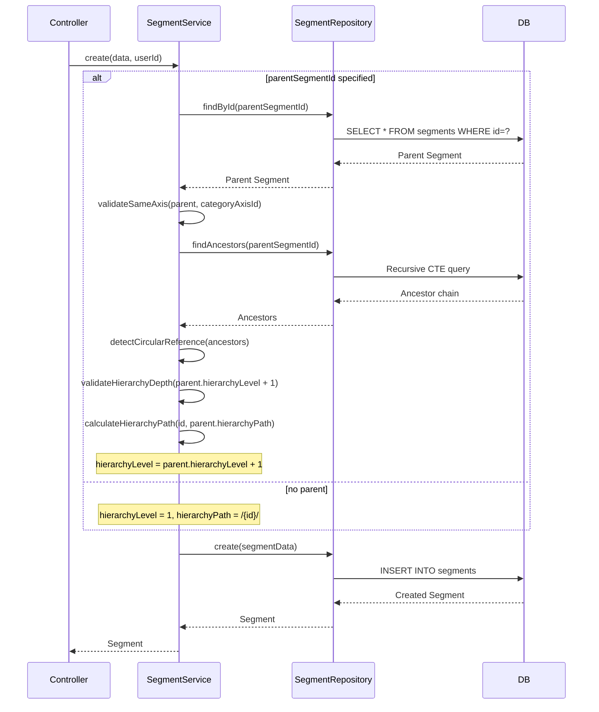
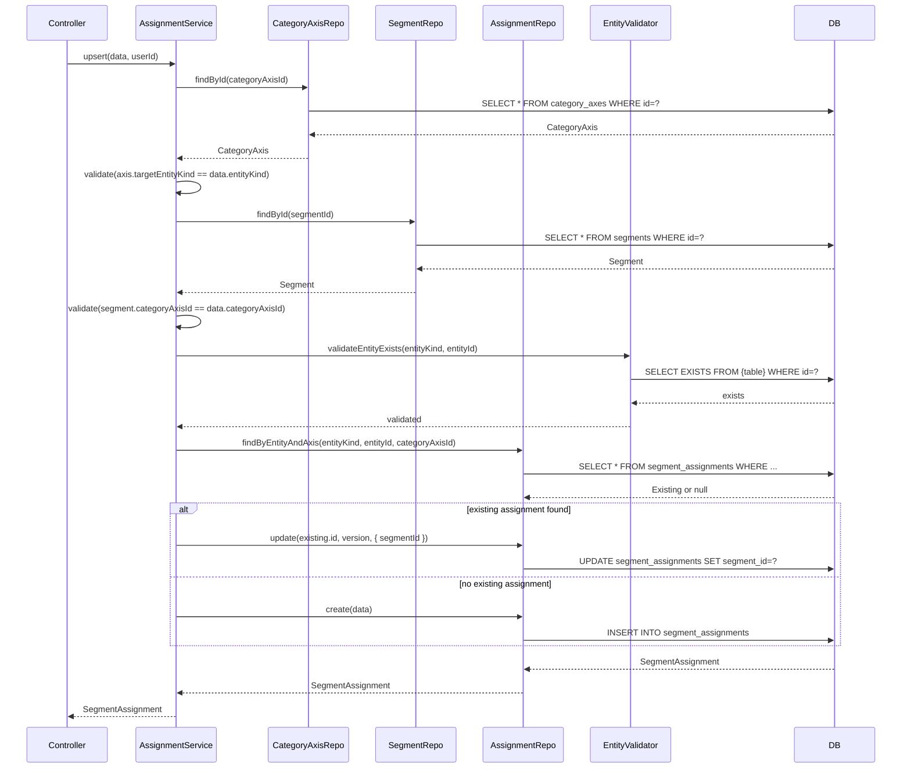
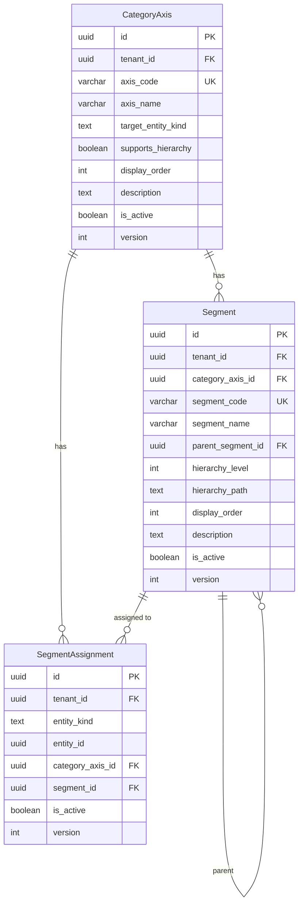

# Technical Design Document

## Feature
`master-data/category-segment`

## Overview

本ドキュメントは、ProcureERP購買管理SaaSにおけるカテゴリ・セグメントマスタ（Category-Segment Master）の技術設計を定義する。

カテゴリ・セグメントは、品目・取引先法人・仕入先拠点などのマスタデータを分類・グルーピング・分析するための柔軟な軸（CategoryAxis）と値（Segment）を管理する機能である。テナントごとに自由にカテゴリ軸を定義し、各マスタに対してセグメント値を割り当てることで、購買分析・仕入先評価・品目分類などの多角的な切り口を実現する。

主要な技術的特徴：
- **Contracts-first**: BFF/API 契約を先行定義し、UI/Backend 実装が契約に従う
- **Polymorphic Assignment**: entity_kind + entity_id による柔軟なエンティティ割当（DB FK制約なし、アプリ層検証）
- **Hierarchy Support**: 品目カテゴリのみ階層構造をサポート（hierarchy_level / hierarchy_path）
- **1軸1値 Constraint**: 1エンティティ×1カテゴリ軸に対して1セグメントのみ割当可能
- **Pass-through Error Policy**: Domain APIのエラーを原則そのまま返す

---

## Architecture

### Architecture Pattern & Boundary Map

**Pattern (fixed)**:
- UI（apps/web） → BFF（apps/bff） → Domain API（apps/api） → DB（PostgreSQL + RLS）
- UI直APIは禁止

**Contracts (SSoT)**:
- UI ↔ BFF: `packages/contracts/src/bff/category-segment`
- BFF ↔ Domain API: `packages/contracts/src/api/category-segment`
- Enum/Error: `packages/contracts/src/api/errors/category-segment-error.ts`
- UI は `packages/contracts/src/api` を参照してはならない

**Boundary Enforcement**:
- BFF: UI入力の正規化（paging/sorting/filtering）、Domain API DTO ⇄ UI DTO の変換
- Domain API: ビジネスルールの正本（軸コード正規化、階層制約、entity_kind整合性検証）
- Repository: tenant_id double-guard（アプリ層 WHERE句 + RLS）

---

## Architecture Responsibilities

### BFF Specification（apps/bff）

**Purpose**
- UI要件に最適化したAPI（Read Model / ViewModel）
- Domain APIのレスポンスを集約・変換（ビジネスルールの正本は持たない）

**BFF Endpoints（UIが叩く）**

| Method | Endpoint | Purpose | Request DTO | Response DTO | Notes |
| ------ | -------- | ------- | ----------- | ------------ | ----- |
| GET | `/api/bff/master-data/category-segment/category-axes` | カテゴリ軸一覧取得 | ListCategoryAxesRequest | ListCategoryAxesResponse | targetEntityKind/keyword/isActiveフィルタ対応 |
| GET | `/api/bff/master-data/category-segment/category-axes/:id` | カテゴリ軸詳細取得 | - | GetCategoryAxisResponse | - |
| POST | `/api/bff/master-data/category-segment/category-axes` | カテゴリ軸新規登録 | CreateCategoryAxisRequest | CreateCategoryAxisResponse | - |
| PUT | `/api/bff/master-data/category-segment/category-axes/:id` | カテゴリ軸更新 | UpdateCategoryAxisRequest | UpdateCategoryAxisResponse | version（楽観ロック）必須 |
| GET | `/api/bff/master-data/category-segment/segments` | セグメント一覧取得 | ListSegmentsRequest | ListSegmentsResponse | categoryAxisId必須、階層ツリー/フラット切替 |
| GET | `/api/bff/master-data/category-segment/segments/:id` | セグメント詳細取得 | - | GetSegmentResponse | - |
| POST | `/api/bff/master-data/category-segment/segments` | セグメント新規登録 | CreateSegmentRequest | CreateSegmentResponse | parentSegmentId オプション |
| PUT | `/api/bff/master-data/category-segment/segments/:id` | セグメント更新 | UpdateSegmentRequest | UpdateSegmentResponse | version（楽観ロック）必須 |
| GET | `/api/bff/master-data/category-segment/assignments` | セグメント割当一覧取得 | ListSegmentAssignmentsRequest | ListSegmentAssignmentsResponse | entityKind+entityId必須 |
| POST | `/api/bff/master-data/category-segment/assignments` | セグメント割当登録/更新 | UpsertSegmentAssignmentRequest | UpsertSegmentAssignmentResponse | 1軸1値 Upsert |
| DELETE | `/api/bff/master-data/category-segment/assignments/:id` | セグメント割当解除 | - | - | 論理削除 |
| GET | `/api/bff/master-data/category-segment/entities/:entityKind/:entityId/segments` | エンティティ別セグメント取得 | - | GetEntitySegmentsResponse | エンティティ詳細画面用 |

**Naming Convention（必須）**
- DTO / Contracts: camelCase（例: `axisCode`, `axisName`, `segmentCode`）
- DB columns: snake_case（例: `axis_code`, `axis_name`, `segment_code`）
- `sortBy` は **DTO側キー**を採用する（例: `axisCode | axisName | displayOrder`）
- DB列名（snake_case）を UI/BFF へ露出させない

**Paging / Sorting Normalization（必須・BFF責務）**
- UI/BFF: page / pageSize（page-based, 1-based）
- Domain API: offset / limit（DB-friendly, 0-based）
- BFFは必ず以下を実施する（省略禁止）：
  - defaults: page=1, pageSize=50, sortBy=displayOrder, sortOrder=asc
  - clamp: pageSize <= 200
  - whitelist: sortBy は許可リストのみ（設計で明記）
    - CategoryAxis: `axisCode | axisName | displayOrder | targetEntityKind | isActive`
    - Segment: `segmentCode | segmentName | displayOrder | hierarchyLevel | isActive`
  - normalize: keyword trim、空→undefined
  - transform: offset=(page-1)*pageSize, limit=pageSize
- Domain APIに渡すのは offset/limit（page/pageSizeは渡さない）
- BFFレスポンスには page/pageSize/total/totalPages を含める（UIへ返すのはBFF側の値）

**Transformation Rules（api DTO → bff DTO）**
- 方針: field rename は行わない（BFF DTO = API DTO の構造を踏襲）
- ListResponse: page/pageSize/total/totalPages を追加（APIは total のみ）

**Error Handling（contracts errorに準拠）**

**Error Policy（必須・未記載禁止）**
- この Feature における BFF の Error Policy は以下とする：
  - 採用方針: **Option A: Pass-through**
  - 採用理由: employee-master / business-partner と同様、Domain APIのエラーを原則そのまま返す。UIは `contracts/bff/errors` に基づいて表示制御を行うため、BFF側での意味的な再分類は不要。責務境界を明確化。

**Option A: Pass-through（採用）**
- Domain APIのエラーを原則そのまま返す（status / code / message / details）
- BFF側での意味的な再分類・書き換えは禁止（ログ付与等の非機能は除く）
- UIは `contracts/bff/errors` に基づいて表示制御を行う

**In all cases**
- 最終拒否権限（403/404/409/422等）は Domain API が持つ

**Authentication / Tenant Context（tenant_id/user_id伝搬）**
- BFF は認証情報（Clerkトークン）から `tenant_id` / `user_id` を解決
- Domain API 呼び出し時に HTTP Header で伝搬（`x-tenant-id`, `x-user-id`）
- Domain API は Header から tenant_id/user_id を取得し、RLS設定 + Repository引数として利用

---

### Service Specification（Domain / apps/api）

**Purpose**
- Domainがビジネスルールの正本（BFF/UIは禁止）
- Transaction boundary / audit points を明記

**Services（Entity単位）**

| Service | Purpose | Key Responsibilities | Transaction Boundary |
| ------- | ------- | -------------------- | -------------------- |
| CategoryAxisService | カテゴリ軸の CRUD | axis_code 正規化、重複チェック、supports_hierarchy 制約検証 | create/update 単位 |
| SegmentService | セグメントの CRUD | segment_code 生成、階層制約検証（循環参照・深度・親セグメント検証）、hierarchy_level/hierarchy_path 自動計算 | create/update 単位 |
| SegmentAssignmentService | セグメント割当の CRUD | entity_kind 整合性検証、1軸1値 Upsert、エンティティ存在検証（アプリ層） | upsert/delete 単位 |

**Service Responsibilities（詳細）**

**CategoryAxisService**:
- axis_code 正規化（normalizeCode ユーティリティ利用、10桁英数字大文字）
- axis_code 重複チェック（UNIQUE制約違反 → AXIS_CODE_DUPLICATE）
- supports_hierarchy 制約検証（target_entity_kind が ITEM 以外の場合、supports_hierarchy = true は禁止）
- 登録後の axis_code / target_entity_kind 変更禁止（更新時は名称・説明・表示順のみ）
- 監査列（created_by_login_account_id / updated_by_login_account_id）への user_id 設定
- 楽観ロック（version）による競合検出

**SegmentService**:
- segment_code 正規化（normalizeCode ユーティリティ利用、10桁英数字大文字）
- segment_code 重複チェック（同一カテゴリ軸内で UNIQUE）
- 階層制約検証:
  - CategoryAxis.supports_hierarchy = false の場合、parent_segment_id は NULL 固定
  - parent_segment_id が同一カテゴリ軸内のセグメントであること
  - 循環参照の検出（親子がループしないこと）
  - 階層深度が最大5レベルを超えないこと
- hierarchy_level / hierarchy_path 自動計算:
  - root: hierarchy_level = 1, hierarchy_path = `/{id}/`
  - child: hierarchy_level = parent.hierarchy_level + 1, hierarchy_path = `{parent.hierarchy_path}{id}/`
- 登録後の segment_code 変更禁止
- 監査列への user_id 設定
- 楽観ロック（version）による競合検出

**SegmentAssignmentService**:
- entity_kind と CategoryAxis.target_entity_kind の一致検証（不一致 → INVALID_ENTITY_KIND）
- segment.category_axis_id = assignment.category_axis_id の検証（不一致 → SEGMENT_NOT_IN_AXIS）
- エンティティ存在検証（entity_kind に応じた対象テーブルに entity_id が存在すること、アプリ層で実施）
- 1軸1値 Upsert:
  - 同一 entity_kind + entity_id + category_axis_id の割当が存在すれば更新
  - 存在しなければ新規作成
- 割当解除は論理削除（is_active = false）
- 監査列への user_id 設定
- 楽観ロック（version）による競合検出

**Audit Points（監査ログ対象）**:
- CategoryAxis / Segment / SegmentAssignment の作成・更新・論理削除
- created_by_login_account_id / updated_by_login_account_id に user_id を必ず設定

**Business Rules Implementation**:
- コード正規化: `normalizeCode(code: string): string`
  - trim（前後空白除去）
  - 全角→半角変換
  - 英字を大文字に統一
  - 正規化後に 10桁チェック（違反時は INVALID_CODE_LENGTH エラー）

- 階層パス計算: `calculateHierarchyPath(segmentId: string, parentPath: string | null): string`
  - 親なし: `/${segmentId}/`
  - 親あり: `${parentPath}${segmentId}/`

- 循環参照検出: `detectCircularReference(segmentId: string, newParentId: string): boolean`
  - newParentId から親を辿り、segmentId に到達したら循環

---

### Repository Specification（apps/api）

**Purpose**
- DBアクセスの唯一の窓口
- tenant_id 必須（全メソッド）
- where句二重ガード必須（アプリ層 + RLS）

**Repositories**

| Repository | Table | Key Methods |
| ---------- | ----- | ----------- |
| CategoryAxisRepository | category_axes | findById, findByCode, list, create, update |
| SegmentRepository | segments | findById, findByCode, list, listTree, create, update, findAncestors, findDescendantIds |
| SegmentAssignmentRepository | segment_assignments | findById, findByEntityAndAxis, listByEntity, listBySegment, listBySegmentWithDescendants, upsert, delete |

**Repository Rules（必須）**:
- すべてのメソッドで `tenantId: string` を引数に受け取る
- すべてのクエリの WHERE句に `tenant_id = ${tenantId}` を明示（double-guard）
- RLS設定を前提とする（`SET app.current_tenant_id = '${tenantId}'` を接続時に実行）
- tenant_id を含まないクエリは禁止

**Key Methods（例: SegmentRepository）**:
- `findById(tenantId: string, id: string): Promise<Segment | null>`
- `findByCode(tenantId: string, categoryAxisId: string, segmentCode: string): Promise<Segment | null>`
- `list(tenantId: string, params: { categoryAxisId, offset, limit, sortBy, sortOrder, keyword?, isActive? }): Promise<{ items, total }>`
- `listTree(tenantId: string, categoryAxisId: string): Promise<SegmentTreeNode[]>` — 階層ツリー形式で取得
- `create(tenantId: string, data: CreateSegmentData): Promise<Segment>`
- `update(tenantId: string, id: string, version: number, data: UpdateSegmentData): Promise<Segment>`
- `findAncestors(tenantId: string, segmentId: string): Promise<Segment[]>` — 循環参照検出用

---

### Contracts Summary（This Feature）

**Contracts Location**:
- BFF Contracts: `packages/contracts/src/bff/category-segment/index.ts`
- API Contracts: `packages/contracts/src/api/category-segment/index.ts`
- Error Definitions: `packages/contracts/src/api/errors/category-segment-error.ts`
- Error Export: `packages/contracts/src/api/errors/index.ts` に export 追加

**DTO Naming Convention（必須）**:
- すべて camelCase（例: `axisCode`, `segmentCode`, `parentSegmentId`）
- DB列名（snake_case）を DTO に露出させない

**Error Codes（定義必須）**:
```typescript
export const CategorySegmentErrorCode = {
  // CategoryAxis
  CATEGORY_AXIS_NOT_FOUND: 'CATEGORY_AXIS_NOT_FOUND', // 404
  AXIS_CODE_DUPLICATE: 'AXIS_CODE_DUPLICATE', // 409
  HIERARCHY_NOT_SUPPORTED: 'HIERARCHY_NOT_SUPPORTED', // 422 (ITEM以外でsupports_hierarchy=true)
  AXIS_CODE_IMMUTABLE: 'AXIS_CODE_IMMUTABLE', // 422 (axis_code変更禁止)
  TARGET_ENTITY_KIND_IMMUTABLE: 'TARGET_ENTITY_KIND_IMMUTABLE', // 422

  // Segment
  SEGMENT_NOT_FOUND: 'SEGMENT_NOT_FOUND', // 404
  SEGMENT_CODE_DUPLICATE: 'SEGMENT_CODE_DUPLICATE', // 409
  SEGMENT_CODE_IMMUTABLE: 'SEGMENT_CODE_IMMUTABLE', // 422
  PARENT_SEGMENT_NOT_FOUND: 'PARENT_SEGMENT_NOT_FOUND', // 404
  PARENT_SEGMENT_WRONG_AXIS: 'PARENT_SEGMENT_WRONG_AXIS', // 422 (親が別軸)
  CIRCULAR_REFERENCE: 'CIRCULAR_REFERENCE', // 422
  HIERARCHY_DEPTH_EXCEEDED: 'HIERARCHY_DEPTH_EXCEEDED', // 422 (最大5レベル超過)
  HIERARCHY_NOT_ALLOWED: 'HIERARCHY_NOT_ALLOWED', // 422 (supports_hierarchy=falseで親指定)

  // SegmentAssignment
  ASSIGNMENT_NOT_FOUND: 'ASSIGNMENT_NOT_FOUND', // 404
  INVALID_ENTITY_KIND: 'INVALID_ENTITY_KIND', // 422 (entity_kind != axis.target_entity_kind)
  SEGMENT_NOT_IN_AXIS: 'SEGMENT_NOT_IN_AXIS', // 422 (segment.category_axis_id != axis.id)
  ENTITY_NOT_FOUND: 'ENTITY_NOT_FOUND', // 404 (参照先エンティティ不存在)

  // Common
  INVALID_CODE_LENGTH: 'INVALID_CODE_LENGTH', // 422
  REQUIRED_FIELD_MISSING: 'REQUIRED_FIELD_MISSING', // 422
  CONCURRENT_UPDATE: 'CONCURRENT_UPDATE', // 409
} as const;
```

**Enum/Error 配置**:
- Error は原則 `packages/contracts/src/api/errors/*` に集約
- Enum（TargetEntityKind）は `packages/contracts/src/api/category-segment/index.ts` に定義

**TargetEntityKind Enum**:
```typescript
export const TargetEntityKind = {
  ITEM: 'ITEM',
  PARTY: 'PARTY',
  SUPPLIER_SITE: 'SUPPLIER_SITE',
} as const;

export type TargetEntityKind = typeof TargetEntityKind[keyof typeof TargetEntityKind];
```

---

## Responsibility Clarification

本Featureにおける責務境界を以下に明記する。未記載の責務は実装してはならない。

### UIの責務
- 表示制御（enable/disable / 文言切替）
- フォーム入力制御・UX最適化（例: 階層ツリー表示、親セグメント選択UI）
- ビジネス判断は禁止（例: 階層有効判定はUI側で行わない、API結果に基づく）

### BFFの責務
- UI入力の正規化（paging: page/pageSize → offset/limit, sorting, filtering）
- Domain API DTO ⇄ UI DTO の変換（本Featureでは構造同一のため実質パススルー）
- エラーの透過（Pass-through方針）
- ビジネスルールの正本は持たない

### Domain APIの責務
- ビジネスルールの正本（コード正規化、階層制約、entity_kind整合性検証）
- 権限・状態遷移の最終判断（is_active=false は新規選択不可）
- 監査ログ・整合性保証（created_by/updated_by 必須設定）
- トランザクション境界の管理

---

## Requirements Traceability

| Requirement | Summary | Components | Interfaces | Flows |
| ----------- | ------- | ---------- | ---------- | ----- |
| 1.1-1.9 | カテゴリ軸（CategoryAxis）の管理 | CategoryAxisService, CategoryAxisRepository, CategoryAxisController | BFF: ListCategoryAxesRequest/Response, CreateCategoryAxisRequest/Response, UpdateCategoryAxisRequest/Response | - |
| 2.1-2.4 | カテゴリ軸の検索・フィルタ | CategoryAxisService, CategoryAxisRepository | BFF: ListCategoryAxesRequest | - |
| 3.1-3.7 | セグメント（Segment）の管理 | SegmentService, SegmentRepository, SegmentController | BFF: ListSegmentsRequest/Response, CreateSegmentRequest/Response, UpdateSegmentRequest/Response | - |
| 4.1-4.6 | セグメントの階層管理 | SegmentService, SegmentRepository | BFF: CreateSegmentRequest (parentSegmentId), ListSegmentsRequest (viewMode=tree) | Hierarchy Calculation Flow |
| 5.1-5.6 | セグメント割当（SegmentAssignment）の管理 | SegmentAssignmentService, SegmentAssignmentRepository, SegmentAssignmentController | BFF: UpsertSegmentAssignmentRequest/Response | Assignment Upsert Flow |
| 6.1-6.4 | エンティティからのセグメント参照 | SegmentAssignmentService | BFF: GetEntitySegmentsResponse | - |
| 7.1-7.3 | セグメントによるフィルタリング | SegmentAssignmentService, SegmentRepository | BFF: FilterBySegmentRequest | Hierarchy Filter Flow |
| 8.1-8.8 | データ整合性と監査 | 全Service（監査列設定）、全Repository（RLS double-guard） | - | - |

---

## Components & Interface Contracts

### Component Summary Table

| Component | Domain | Intent | Requirements | Dependencies | Contracts |
| --------- | ------ | ------ | ------------ | ------------ | --------- |
| CategoryAxisController | master-data | カテゴリ軸 CRUD API提供 | 1.1-1.9, 2.1-2.4 | CategoryAxisService | Service: ☑, API: ☑ |
| CategoryAxisService | master-data | カテゴリ軸 ビジネスロジック | 1.1-1.9, 2.1-2.4 | CategoryAxisRepository, normalizeCode | Service: ☑ |
| CategoryAxisRepository | master-data | カテゴリ軸 DBアクセス | 1.1-1.9, 8.6 | Prisma | - |
| SegmentController | master-data | セグメント CRUD API提供 | 3.1-3.7, 4.1-4.6 | SegmentService | Service: ☑, API: ☑ |
| SegmentService | master-data | セグメント ビジネスロジック、階層計算 | 3.1-3.7, 4.1-4.6 | SegmentRepository, CategoryAxisRepository, normalizeCode | Service: ☑ |
| SegmentRepository | master-data | セグメント DBアクセス | 3.1-3.7, 8.7 | Prisma | - |
| SegmentAssignmentController | master-data | セグメント割当 CRUD API提供 | 5.1-5.6, 6.1-6.4 | SegmentAssignmentService | Service: ☑, API: ☑ |
| SegmentAssignmentService | master-data | セグメント割当 ビジネスロジック | 5.1-5.6, 6.1-6.4, 7.1-7.3 | SegmentAssignmentRepository, CategoryAxisRepository, SegmentRepository | Service: ☑ |
| SegmentAssignmentRepository | master-data | セグメント割当 DBアクセス | 5.1-5.6, 8.8 | Prisma | - |
| BFF Controller | bff | UI向けエンドポイント提供 | All | Domain API Client | Service: ☑, API: ☑ |
| normalizeCode | common/utils | コード正規化ユーティリティ | 1.3, 3.3 | - | - |
| EntityValidatorService | common/validators | Polymorphic FK エンティティ存在検証 | 5.6 | PartyRepository, SupplierSiteRepository | Service: ☑ |

### Dependencies Table

| Component | Dependency | Type | Criticality | Notes |
| --------- | ---------- | ---- | ----------- | ----- |
| SegmentService | CategoryAxisRepository | Inbound | P0 | supports_hierarchy 検証のため必須 |
| SegmentAssignmentService | CategoryAxisRepository | Inbound | P0 | target_entity_kind 検証のため必須 |
| SegmentAssignmentService | SegmentRepository | Inbound | P0 | segment.category_axis_id 検証のため必須 |
| SegmentAssignmentService | EntityValidatorService | Inbound | P0 | エンティティ存在検証のため必須（下記参照） |
| All Services | normalizeCode | Inbound | P0 | コード正規化のため必須 |
| All Repositories | Prisma | External | P0 | ORM |
| BFF | Domain API | External | P0 | HTTP Client経由 |

---

### CategoryAxisController（Domain API）

**Intent**: CategoryAxis（カテゴリ軸）の CRUD API を提供

**Service Interface**:
```typescript
interface ICategoryAxisService {
  list(params: ListCategoryAxesParams): Promise<{ items: CategoryAxis[], total: number }>;
  getById(id: string): Promise<CategoryAxis>;
  create(data: CreateCategoryAxisData, userId: string): Promise<CategoryAxis>;
  update(id: string, version: number, data: UpdateCategoryAxisData, userId: string): Promise<CategoryAxis>;
}

interface ListCategoryAxesParams {
  tenantId: string;
  offset: number;
  limit: number;
  sortBy?: 'axisCode' | 'axisName' | 'displayOrder' | 'targetEntityKind' | 'isActive';
  sortOrder?: 'asc' | 'desc';
  keyword?: string;
  targetEntityKind?: TargetEntityKind;
  isActive?: boolean;
}

interface CreateCategoryAxisData {
  tenantId: string;
  axisCode: string;
  axisName: string;
  targetEntityKind: TargetEntityKind;
  supportsHierarchy: boolean;
  displayOrder?: number;
  description?: string;
}

interface UpdateCategoryAxisData {
  axisName: string;
  displayOrder?: number;
  description?: string;
  isActive?: boolean;
  // axis_code / target_entity_kind は変更不可
}
```

**Error Handling**:
- CATEGORY_AXIS_NOT_FOUND（404）: getById/update時に存在しない
- AXIS_CODE_DUPLICATE（409）: create時に重複
- HIERARCHY_NOT_SUPPORTED（422）: ITEM以外で supports_hierarchy = true
- AXIS_CODE_IMMUTABLE（422）: axis_code 変更試行
- TARGET_ENTITY_KIND_IMMUTABLE（422）: target_entity_kind 変更試行
- CONCURRENT_UPDATE（409）: version 不一致

**Implementation Notes**:
- create時に normalizeCode を呼び出し、axis_code を正規化
- create時に supports_hierarchy = true かつ target_entity_kind != ITEM の場合エラー
- update時に axis_code / target_entity_kind の変更を禁止
- created_by/updated_by に userId を必ず設定

---

### SegmentController（Domain API）

**Intent**: Segment（セグメント）の CRUD API を提供、階層管理機能を含む

**Service Interface**:
```typescript
interface ISegmentService {
  list(params: ListSegmentsParams): Promise<{ items: Segment[], total: number }>;
  listTree(tenantId: string, categoryAxisId: string): Promise<SegmentTreeNode[]>;
  getById(id: string): Promise<Segment>;
  create(data: CreateSegmentData, userId: string): Promise<Segment>;
  update(id: string, version: number, data: UpdateSegmentData, userId: string): Promise<Segment>;
}

interface ListSegmentsParams {
  tenantId: string;
  categoryAxisId: string;
  offset: number;
  limit: number;
  sortBy?: 'segmentCode' | 'segmentName' | 'displayOrder' | 'hierarchyLevel' | 'isActive';
  sortOrder?: 'asc' | 'desc';
  keyword?: string;
  isActive?: boolean;
}

interface CreateSegmentData {
  tenantId: string;
  categoryAxisId: string;
  segmentCode: string;
  segmentName: string;
  parentSegmentId?: string;
  displayOrder?: number;
  description?: string;
}

interface UpdateSegmentData {
  segmentName: string;
  parentSegmentId?: string | null; // null で親を解除
  displayOrder?: number;
  description?: string;
  isActive?: boolean;
  // segment_code は変更不可
}

interface SegmentTreeNode {
  id: string;
  segmentCode: string;
  segmentName: string;
  hierarchyLevel: number;
  children: SegmentTreeNode[];
}
```

**Error Handling**:
- SEGMENT_NOT_FOUND（404）
- SEGMENT_CODE_DUPLICATE（409）
- SEGMENT_CODE_IMMUTABLE（422）
- PARENT_SEGMENT_NOT_FOUND（404）
- PARENT_SEGMENT_WRONG_AXIS（422）
- CIRCULAR_REFERENCE（422）
- HIERARCHY_DEPTH_EXCEEDED（422）
- HIERARCHY_NOT_ALLOWED（422）
- CONCURRENT_UPDATE（409）

**Implementation Notes**:
- create/update時に normalizeCode を呼び出し、segment_code を正規化
- create時に CategoryAxis を取得し supports_hierarchy を検証
- parentSegmentId 指定時の検証:
  1. 親セグメントが存在すること
  2. 親セグメントが同一カテゴリ軸に属すること
  3. 循環参照が発生しないこと（findAncestors で検出）
  4. 階層深度が5を超えないこと
- hierarchy_level / hierarchy_path を自動計算して設定

**Hierarchy Calculation Flow**:


---

### SegmentAssignmentController（Domain API）

**Intent**: SegmentAssignment（セグメント割当）の CRUD API を提供、1軸1値のUpsert機能を含む

**Service Interface**:
```typescript
interface ISegmentAssignmentService {
  listByEntity(params: ListByEntityParams): Promise<SegmentAssignment[]>;
  listBySegment(params: ListBySegmentParams): Promise<{ items: SegmentAssignment[], total: number }>;
  upsert(data: UpsertSegmentAssignmentData, userId: string): Promise<SegmentAssignment>;
  delete(id: string, version: number, userId: string): Promise<void>;
  getEntitySegments(tenantId: string, entityKind: TargetEntityKind, entityId: string): Promise<EntitySegmentInfo[]>;
}

interface ListByEntityParams {
  tenantId: string;
  entityKind: TargetEntityKind;
  entityId: string;
}

interface ListBySegmentParams {
  tenantId: string;
  segmentId: string;
  offset: number;
  limit: number;
}

interface UpsertSegmentAssignmentData {
  tenantId: string;
  entityKind: TargetEntityKind;
  entityId: string;
  categoryAxisId: string;
  segmentId: string;
}

interface EntitySegmentInfo {
  categoryAxisId: string;
  categoryAxisName: string;
  segmentId: string;
  segmentCode: string;
  segmentName: string;
}
```

**Error Handling**:
- ASSIGNMENT_NOT_FOUND（404）
- INVALID_ENTITY_KIND（422）
- SEGMENT_NOT_IN_AXIS（422）
- ENTITY_NOT_FOUND（404）
- CONCURRENT_UPDATE（409）

**Implementation Notes**:
- upsert時の検証:
  1. CategoryAxis を取得し target_entity_kind == entity_kind を検証
  2. Segment を取得し category_axis_id == categoryAxisId を検証
  3. エンティティ存在検証（entity_kind に応じた対象サービスを呼び出し）
- 既存割当の検索（entity_kind + entity_id + category_axis_id）
  - 存在すれば segment_id を更新（1軸1値）
  - 存在しなければ新規作成

**Assignment Upsert Flow**:


---

### normalizeCode（共通ユーティリティ）

**Intent**: 業務コード（axis_code, segment_code）の正規化処理を提供

**Interface**:
```typescript
function normalizeCode(code: string, maxLength: number = 10): string {
  // 1. trim（前後空白除去）
  let normalized = code.trim();

  // 2. 全角→半角変換
  normalized = toHalfWidth(normalized);

  // 3. 英字を大文字に統一
  normalized = normalized.toUpperCase();

  // 4. 長さチェック
  if (normalized.length > maxLength) {
    throw new CategorySegmentError('INVALID_CODE_LENGTH', `Code must be at most ${maxLength} characters, got ${normalized.length}`);
  }

  // 5. パターンチェック（英数字のみ）
  const pattern = /^[0-9A-Z]+$/;
  if (!pattern.test(normalized)) {
    throw new CategorySegmentError('INVALID_CODE_LENGTH', 'Code must contain only alphanumeric characters');
  }

  return normalized;
}

function toHalfWidth(str: string): string {
  return str.replace(/[A-Za-z0-9]/g, (s) => String.fromCharCode(s.charCodeAt(0) - 0xFEE0));
}
```

---

### EntityValidatorService（共通モジュール）

**Intent**: Polymorphic FK のエンティティ存在検証を一元的に提供（apps/api/src/common に配置）

**Interface**:
```typescript
interface IEntityValidatorService {
  /**
   * entity_kind に応じた対象テーブルに entity_id が存在するかを検証する
   * @throws ENTITY_NOT_FOUND (404) if entity does not exist
   */
  validateEntityExists(tenantId: string, entityKind: TargetEntityKind, entityId: string): Promise<void>;
}
```

**Implementation Notes**:
- entity_kind に応じて対象 Repository を呼び分ける:
  - `ITEM` → ItemRepository.findById（将来実装）
  - `PARTY` → PartyRepository.findById
  - `SUPPLIER_SITE` → SupplierSiteRepository.findById
- Repository が null を返した場合、`ENTITY_NOT_FOUND` エラーを throw
- 循環参照を避けるため、各 Repository を直接 DI（Service 層ではなく Repository 層を参照）
- 本サービスは `apps/api/src/common/validators/entity-validator.service.ts` に配置

**Dependency Injection**:
```typescript
@Injectable()
export class EntityValidatorService implements IEntityValidatorService {
  constructor(
    private readonly partyRepository: PartyRepository,
    private readonly supplierSiteRepository: SupplierSiteRepository,
    // ItemRepository は item-master 実装時に追加
  ) {}

  async validateEntityExists(tenantId: string, entityKind: TargetEntityKind, entityId: string): Promise<void> {
    let exists = false;
    switch (entityKind) {
      case 'PARTY':
        exists = !!(await this.partyRepository.findById(tenantId, entityId));
        break;
      case 'SUPPLIER_SITE':
        exists = !!(await this.supplierSiteRepository.findById(tenantId, entityId));
        break;
      case 'ITEM':
        // TODO: ItemRepository 実装後に追加
        throw new Error('ITEM validation not yet implemented');
    }
    if (!exists) {
      throw new CategorySegmentError('ENTITY_NOT_FOUND', `Entity ${entityKind}:${entityId} not found`);
    }
  }
}
```

---

### 階層フィルタリングクエリ設計（Requirement 7.3）

**Intent**: 親セグメントを選択した場合に子孫セグメントが割り当てられたエンティティも含めてフィルタリングする

**Query Pattern**:
```typescript
// SegmentRepository.findDescendantIds
async findDescendantIds(tenantId: string, segmentId: string): Promise<string[]> {
  const segment = await this.findById(tenantId, segmentId);
  if (!segment) return [];

  // hierarchy_path を使った LIKE prefix 検索
  // 例: segment.hierarchy_path = '/abc123/' の場合
  // 子孫は '/abc123/%' にマッチする
  const descendants = await this.prisma.segment.findMany({
    where: {
      tenantId,
      hierarchyPath: { startsWith: segment.hierarchyPath },
      id: { not: segmentId }, // 自分自身は除外
      isActive: true,
    },
    select: { id: true },
  });

  return [segmentId, ...descendants.map(d => d.id)];
}

// SegmentAssignmentRepository.listBySegmentWithDescendants
async listBySegmentWithDescendants(
  tenantId: string,
  segmentId: string,
  params: { offset: number; limit: number }
): Promise<{ items: SegmentAssignment[]; total: number }> {
  // 1. 対象セグメントとその子孫の ID を取得
  const segmentIds = await this.segmentRepository.findDescendantIds(tenantId, segmentId);

  // 2. 子孫を含むセグメント ID で割当を検索
  const [items, total] = await Promise.all([
    this.prisma.segmentAssignment.findMany({
      where: {
        tenantId,
        segmentId: { in: segmentIds },
        isActive: true,
      },
      skip: params.offset,
      take: params.limit,
    }),
    this.prisma.segmentAssignment.count({
      where: {
        tenantId,
        segmentId: { in: segmentIds },
        isActive: true,
      },
    }),
  ]);

  return { items, total };
}
```

**Performance Consideration**:
- `hierarchy_path` の INDEX（`tenant_id, hierarchy_path`）により LIKE prefix 検索を高速化
- セグメント数上限（1軸あたり最大1000件）により、`segmentIds` 配列は実用上問題なし
- 大量データ時は Recursive CTE に切り替え可能（Phase 2 検討）

---

## Data Models

### Domain Model

**Entities**:

1. **CategoryAxis（カテゴリ軸）**
   - Aggregate Root: CategoryAxis
   - Invariants:
     - axis_code は UNIQUE(tenant_id, axis_code)、変更不可
     - supports_hierarchy = true は target_entity_kind = ITEM の場合のみ

2. **Segment（セグメント）**
   - Aggregate Root: Segment
   - Parent: CategoryAxis
   - Self-Reference: parent_segment_id（階層有効時のみ）
   - Value Objects: HierarchyInfo（hierarchy_level, hierarchy_path）
   - Invariants:
     - segment_code は UNIQUE(tenant_id, category_axis_id, segment_code)、変更不可
     - 循環参照禁止
     - 階層深度 <= 5

3. **SegmentAssignment（セグメント割当）**
   - Aggregate Root: SegmentAssignment
   - Polymorphic Reference: entity_kind + entity_id
   - Invariants:
     - UNIQUE(tenant_id, entity_kind, entity_id, category_axis_id) — 1軸1値
     - entity_kind == category_axis.target_entity_kind
     - segment.category_axis_id == category_axis_id

**Entity Relationships**:


### Logical Data Model

**Schema Definition**（Prisma）:

```prisma
model CategoryAxis {
  id                      String    @id @default(uuid())
  tenantId                String    @map("tenant_id")
  axisCode                String    @map("axis_code") @db.VarChar(10)
  axisName                String    @map("axis_name") @db.VarChar(100)
  targetEntityKind        String    @map("target_entity_kind")
  supportsHierarchy       Boolean   @default(false) @map("supports_hierarchy")
  displayOrder            Int       @default(1000) @map("display_order")
  description             String?
  isActive                Boolean   @default(true) @map("is_active")
  version                 Int       @default(1)
  createdAt               DateTime  @default(now()) @map("created_at")
  updatedAt               DateTime  @updatedAt @map("updated_at")
  createdByLoginAccountId String?   @map("created_by_login_account_id")
  updatedByLoginAccountId String?   @map("updated_by_login_account_id")

  segments                Segment[]
  assignments             SegmentAssignment[]

  @@unique([tenantId, axisCode])
  @@index([tenantId, axisCode])
  @@index([tenantId, targetEntityKind])
  @@index([tenantId, displayOrder])
  @@index([tenantId, isActive])
  @@map("category_axes")
}

model Segment {
  id                      String    @id @default(uuid())
  tenantId                String    @map("tenant_id")
  categoryAxisId          String    @map("category_axis_id")
  segmentCode             String    @map("segment_code") @db.VarChar(10)
  segmentName             String    @map("segment_name") @db.VarChar(100)
  parentSegmentId         String?   @map("parent_segment_id")
  hierarchyLevel          Int       @default(1) @map("hierarchy_level")
  hierarchyPath           String?   @map("hierarchy_path")
  displayOrder            Int       @default(1000) @map("display_order")
  description             String?
  isActive                Boolean   @default(true) @map("is_active")
  version                 Int       @default(1)
  createdAt               DateTime  @default(now()) @map("created_at")
  updatedAt               DateTime  @updatedAt @map("updated_at")
  createdByLoginAccountId String?   @map("created_by_login_account_id")
  updatedByLoginAccountId String?   @map("updated_by_login_account_id")

  categoryAxis            CategoryAxis @relation(fields: [tenantId, categoryAxisId], references: [tenantId, id])
  parentSegment           Segment?     @relation("SegmentHierarchy", fields: [tenantId, parentSegmentId], references: [tenantId, id])
  childSegments           Segment[]    @relation("SegmentHierarchy")
  assignments             SegmentAssignment[]

  @@unique([tenantId, categoryAxisId, segmentCode])
  @@index([tenantId, categoryAxisId])
  @@index([tenantId, categoryAxisId, displayOrder])
  @@index([tenantId, categoryAxisId, isActive])
  @@index([tenantId, hierarchyPath])
  @@map("segments")
}

model SegmentAssignment {
  id                      String    @id @default(uuid())
  tenantId                String    @map("tenant_id")
  entityKind              String    @map("entity_kind")
  entityId                String    @map("entity_id")
  categoryAxisId          String    @map("category_axis_id")
  segmentId               String    @map("segment_id")
  isActive                Boolean   @default(true) @map("is_active")
  version                 Int       @default(1)
  createdAt               DateTime  @default(now()) @map("created_at")
  updatedAt               DateTime  @updatedAt @map("updated_at")
  createdByLoginAccountId String?   @map("created_by_login_account_id")
  updatedByLoginAccountId String?   @map("updated_by_login_account_id")

  categoryAxis            CategoryAxis @relation(fields: [tenantId, categoryAxisId], references: [tenantId, id])
  segment                 Segment      @relation(fields: [tenantId, segmentId], references: [tenantId, id])

  @@unique([tenantId, entityKind, entityId, categoryAxisId])
  @@index([tenantId, entityKind, entityId])
  @@index([tenantId, categoryAxisId])
  @@index([tenantId, segmentId])
  @@map("segment_assignments")
}
```

**Indexing Strategy**:
- UNIQUE制約: コード重複防止（tenant_id + axis_code / tenant_id + category_axis_id + segment_code）
- UNIQUE制約: 1軸1値（tenant_id + entity_kind + entity_id + category_axis_id）
- INDEX: 一覧取得の高速化（tenant_id + is_active, tenant_id + display_order）
- INDEX: 階層検索用（tenant_id + hierarchy_path）

**RLS Policy**（PostgreSQL）:
```sql
-- category_axes
CREATE POLICY category_axes_tenant_isolation ON category_axes
  USING (tenant_id = current_setting('app.current_tenant_id', true)::text);

-- segments
CREATE POLICY segments_tenant_isolation ON segments
  USING (tenant_id = current_setting('app.current_tenant_id', true)::text);

-- segment_assignments
CREATE POLICY segment_assignments_tenant_isolation ON segment_assignments
  USING (tenant_id = current_setting('app.current_tenant_id', true)::text);
```

---

## Technology Stack & Alignment

本Featureで使用する技術スタックは、既存の employee-master / business-partner 実装パターンと完全に一致する。

| Layer | Technology | Version | Role | Notes |
| ----- | ---------- | ------- | ---- | ----- |
| Frontend | Next.js | 15.x | UI フレームワーク | App Router |
| Frontend | React | 19.x | UI ライブラリ | - |
| Frontend | TypeScript | 5.x | 型安全性 | - |
| Frontend | TanStack Query | 5.x | Server State 管理 | - |
| Frontend | React Hook Form | 7.x | Form State 管理 | - |
| BFF | NestJS | 10.x | API フレームワーク | - |
| BFF | TypeScript | 5.x | 型安全性 | - |
| Domain API | NestJS | 10.x | API フレームワーク | Modular Monolith |
| Domain API | Prisma | 6.x | ORM | - |
| Database | PostgreSQL | 16.x | RDBMS | RLS有効 |
| Contracts | TypeScript | 5.x | 契約定義 | SSoT |

---

## Error Handling

**Error Code Definition**（`packages/contracts/src/api/errors/category-segment-error.ts`）:
- CategorySegmentErrorCode 定数を定義
- HTTP Status Code マッピングを定義
- デフォルトメッセージ（日本語）を定義

**Error Response Format**:
```typescript
{
  code: 'AXIS_CODE_DUPLICATE',
  message: '軸コードが重複しています',
  details?: {
    axisCode: 'CAT001'
  }
}
```

**Error Handling Strategy**:
- Domain API でエラーを throw（NestJS Exception Filter が捕捉）
- BFF は Pass-through（エラーをそのまま返す）
- UI は error.code に基づいて表示制御

---

## Testing Strategy

**Unit Test**:
- normalizeCode: 正規化ロジックの各パターン（trim, 半角化, 大文字統一, 長さチェック）
- SegmentService.calculateHierarchyPath: 階層パス計算の各パターン
- SegmentService.detectCircularReference: 循環参照検出

**Integration Test**:
- CategoryAxis作成 + Segment作成の一連フロー
- Segment階層作成（親→子→孫）と階層パス検証
- SegmentAssignment Upsert（新規作成→更新）
- 楽観ロック（version）による競合検出

**E2E Test**:
- CategoryAxis登録 → Segment登録 → SegmentAssignment登録 → エンティティ詳細画面でのセグメント表示確認
- 階層ツリー表示の確認
- セグメントによるフィルタリング確認

---

## Security Considerations

**Multi-tenant Isolation**:
- すべての Repository メソッドで tenant_id を引数に受け取る
- RLS ポリシーを全テーブルに適用（tenant_id 境界を DB層でも保証）
- BFF が認証情報から tenant_id を解決（Clerk トークン検証）

**Audit Trail**:
- created_by/updated_by に user_id を必ず設定（アプリ層で実質必須）
- 誰がいつ何を変更したかを追跡可能

**Input Validation**:
- コード正規化により、入力揺れを防止
- UNIQUE制約により、DB層でも重複防止

**Polymorphic Reference Integrity**:
- entity_kind + entity_id の参照整合性は DB FK では担保できない
- アプリ層で登録/更新時にエンティティ存在検証を必須実施
- nightly batch で整合性監査（欠損・不整合の検出）を実施し、検出時はアラート

---

## Performance Considerations

**Indexing**:
- tenant_id + is_active: 一覧取得の高速化
- tenant_id + category_axis_id: セグメント一覧取得の高速化
- tenant_id + entity_kind + entity_id: 割当検索の高速化
- tenant_id + hierarchy_path: 階層検索（LIKE prefix 検索）の高速化

**Query Optimization**:
- Repository の list メソッドで offset/limit を適用（全件取得を回避）
- sortBy は INDEX が効く列を優先（displayOrder, axisCode, segmentCode）
- 階層ツリー取得は Recursive CTE を使用

**Scalability Limits**:
- 1テナントあたり最大100カテゴリ軸
- 1カテゴリ軸あたり最大1000セグメント
- 階層深度は最大5レベル

---

## Migration & Rollout Strategy

**Phase 1（MVP）**:
- CategoryAxis / Segment / SegmentAssignment の CRUD 実装
- 階層管理機能（品目カテゴリのみ）
- エンティティ詳細画面からのセグメント参照・編集

**Phase 2（将来拡張）**:
- セグメント割当の一括インポート・エクスポート
- セグメントによる購買分析ダッシュボード
- トランザクション（PO_LINE等）への割当拡張

**Migration Notes**:
- 既存データがない想定（新規Feature）
- DB Migration は Prisma Migrate で管理

---

## Open Questions

1. **nightly batch 整合性監査の運用ポリシー**: 不整合検出時のアラート先・自動無効化 vs 手動対応（運用フィードバック後に決定）
2. **階層ツリーUI**: ドラッグ＆ドロップによる並び替え対応の要否（Phase 2 検討）
3. **セグメント選択UI**: セグメント数が多い場合のサジェスト検索対応（Phase 2 検討）

---

## References

- [カテゴリ・セグメントエンティティ定義](.kiro/specs/spec_doc/61_機能設計検討/02_エンティティ定義/07_カテゴリ・セグメントエンティティ定義.md)
- [Employee Master API Contracts](packages/contracts/src/api/employee-master/index.ts)
- [Business Partner Design](file:///c:/10_dev/ProcureERP-SDD/.kiro/specs/master-data/business-partner/design.md)
