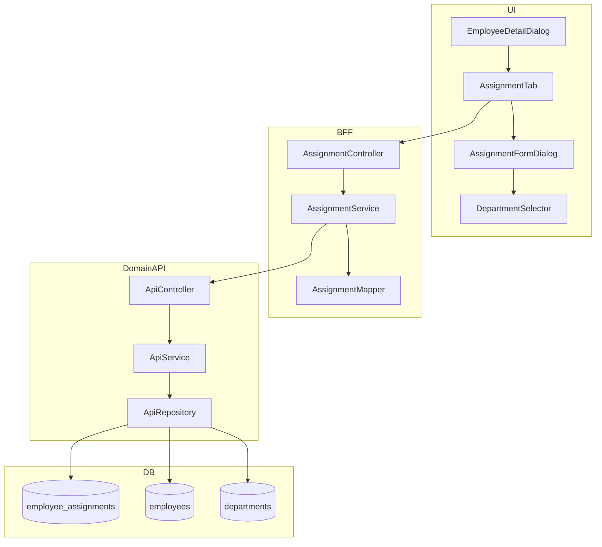
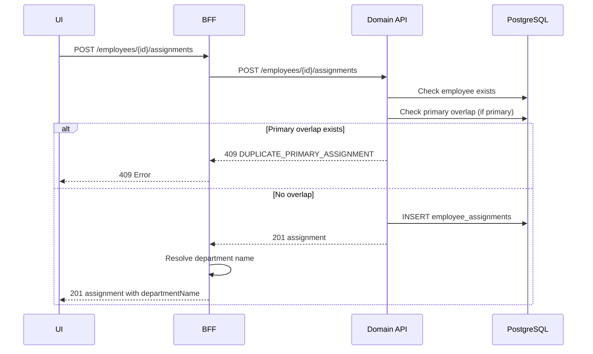
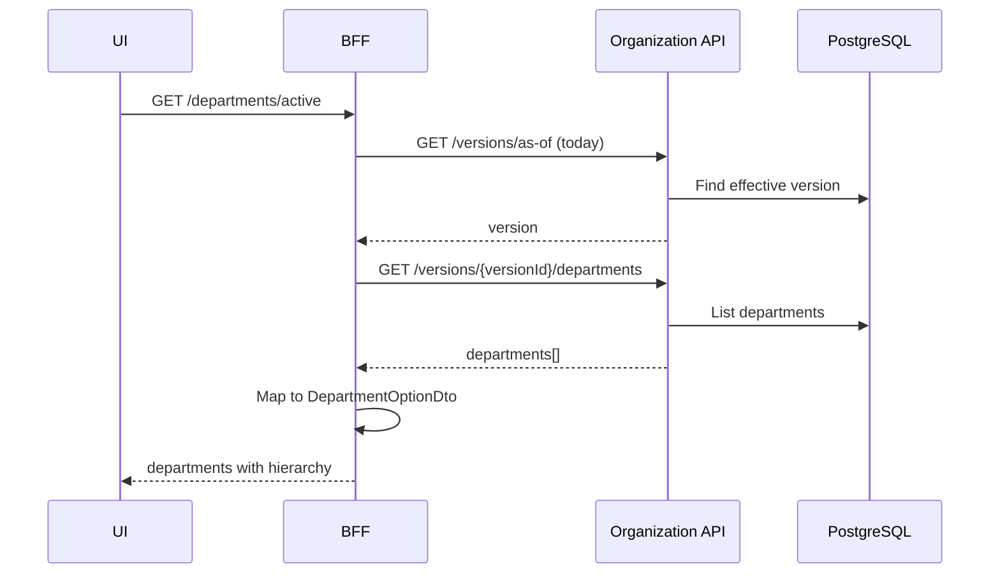

# Design Document: employee-assignment

## Overview

社員所属履歴（employee_assignments）の管理機能。社員マスタから主務/兼務の所属部門を期間履歴で登録・管理する。

本機能は既存の employee-master および organization-master と連携し、社員と部門の関係を期間付きで管理する。部門は `department_stable_id`（版非依存キー）で接続することで、組織改編に対する耐性を持つ。

主要な技術的決定事項：
- 独立モジュールとして `apps/api/src/modules/master-data/employee-assignment/` に実装
- 主務重複チェックはDomain API Service層で実装（DB制約は将来検討）
- 部門名解決はBFF層で実施（UIはstable_idを意識しない）

---

## Architecture

### Architecture Pattern & Boundary Map

**Pattern (fixed)**:
- UI（apps/web） → BFF（apps/bff） → Domain API（apps/api） → DB（PostgreSQL + RLS）
- UI直APIは禁止

**Contracts (SSoT)**:
- UI ↔ BFF: `packages/contracts/src/bff/employee-assignment`
- BFF ↔ Domain API: `packages/contracts/src/api/employee-assignment`
- API Errors: `packages/contracts/src/api/errors/employee-assignment-error.ts`
- BFF Errors: `packages/contracts/src/bff/errors/employee-assignment-error.ts`（API側を re-export）
- UI は `packages/contracts/src/api` を参照してはならない（bff/errors のみ参照可）



---

## Architecture Responsibilities（Mandatory）

### BFF Specification（apps/bff）

**Purpose**
- UI要件に最適化したAPI（所属情報の一覧・登録・編集・削除）
- Domain APIのレスポンスを集約・変換（部門名解決を含む）
- ビジネスルールの正本は持たない

**BFF Endpoints（UIが叩く）**

| Method | Endpoint | Purpose | Request DTO | Response DTO | Notes |
|--------|----------|---------|-------------|--------------|-------|
| GET | `/api/bff/employees/{employeeId}/assignments` | 所属一覧取得 | - | `ListAssignmentsResponse` | 有効開始日降順、部門名解決済み |
| POST | `/api/bff/employees/{employeeId}/assignments` | 所属登録 | `CreateAssignmentRequest` | `CreateAssignmentResponse` | 主務重複チェック実施 |
| PUT | `/api/bff/employees/{employeeId}/assignments/{id}` | 所属更新 | `UpdateAssignmentRequest` | `UpdateAssignmentResponse` | 楽観ロック |
| DELETE | `/api/bff/employees/{employeeId}/assignments/{id}` | 所属削除 | - | `DeleteAssignmentResponse` | 論理削除 |
| GET | `/api/bff/departments/active` | 有効部門一覧 | - | `ListActiveDepartmentsResponse` | 現在有効版の部門ツリー |

**Naming Convention（必須）**
- DTO / Contracts: camelCase（例: `departmentStableId`, `effectiveDate`）
- DB columns: snake_case（例: `department_stable_id`, `effective_date`）
- `sortBy` は **DTO側キー**を採用する（例: `effectiveDate`）

**Paging / Sorting Normalization（必須・BFF責務）**
- 所属一覧は社員単位での取得のため、ページングは不要（件数が限定的）
- ソートは固定: 有効開始日（effectiveDate）降順
- フィルタリング: is_active=true のみ返却

**Transformation Rules（api DTO → bff DTO）**
- `departmentStableId` → `departmentName`（部門名解決）：BFFが現在有効版の部門名を解決して付与
- `assignmentType` → `assignmentTypeLabel`：primary/secondary を 主務/兼務 に変換

**Error Handling（contracts errorに準拠）**

**Error Policy（必須・未記載禁止）**
- 採用方針：**Option A: Pass-through**
- 採用理由：所属管理は標準的なCRUD操作であり、Domain APIのエラーをそのままUIに伝播すれば十分。UIでの表示制御は contracts/bff/errors に基づいて行う。

**Authentication / Tenant Context（tenant_id/user_id伝搬）**
- BFF は認証ミドルウェアから `tenant_id` / `user_id` を取得
- Domain API 呼び出し時に Header（`X-Tenant-Id`, `X-User-Id`）で伝搬

---

### Service Specification（Domain / apps/api）

**Purpose**
- ビジネスルールの正本
- 主務重複チェック、期間整合性チェック、楽観ロック

**Business Rules**

| Rule | Description | Error Code |
|------|-------------|------------|
| 主務重複禁止 | 同一社員・同時期に primary は1つのみ | `DUPLICATE_PRIMARY_ASSIGNMENT` |
| 期間整合性 | expiry_date は effective_date より後 | `INVALID_DATE_RANGE` |
| 按分率範囲 | 0.00 ≤ allocation_ratio ≤ 100.00 | `INVALID_ALLOCATION_RATIO` |
| 楽観ロック | version 不一致で競合検出 | `OPTIMISTIC_LOCK_ERROR` |
| 社員存在チェック | employee_id が存在すること | `EMPLOYEE_NOT_FOUND` |
| 部門存在チェック | department_stable_id が存在すること | `DEPARTMENT_NOT_FOUND` |

**Transaction Boundary**
- 登録・更新・削除は単一トランザクション
- 主務重複チェックはトランザクション内で実施

**Audit Points**
- 所属の作成: created_at, created_by を記録
- 所属の更新: updated_at, updated_by を記録
- 所属の削除（論理）: updated_at, updated_by, is_active=false を記録

---

### Repository Specification（apps/api）

**Methods**

| Method | Parameters | Returns | Notes |
|--------|------------|---------|-------|
| `findByEmployeeId` | tenantId, employeeId | EmployeeAssignment[] | is_active=true のみ |
| `findOne` | tenantId, assignmentId | EmployeeAssignment \| null | - |
| `create` | tenantId, createdBy, data | EmployeeAssignment | - |
| `update` | tenantId, assignmentId, version, updatedBy, data | EmployeeAssignment \| null | 楽観ロック、null=競合 |
| `softDelete` | tenantId, assignmentId, version, updatedBy | boolean | is_active=false に更新 |
| `checkPrimaryOverlap` | tenantId, employeeId, effectiveDate, expiryDate, excludeId? | boolean | 主務重複チェック |

**Constraints**
- tenant_id 必須（全メソッド）
- where句二重ガード必須
- set_config 前提（RLS無効化禁止）

---

### Contracts Summary（This Feature）

**API Contracts（packages/contracts/src/api/employee-assignment/index.ts）**

```typescript
// Assignment Type
export type AssignmentType = 'primary' | 'secondary';

// Sort Options
export type AssignmentSortBy = 'effectiveDate' | 'assignmentType';
export type SortOrder = 'asc' | 'desc';

// EmployeeAssignmentApiDto
export interface EmployeeAssignmentApiDto {
  id: string;
  employeeId: string;
  departmentStableId: string;
  assignmentType: AssignmentType;
  allocationRatio: number | null; // 0.00-100.00
  title: string | null;
  effectiveDate: string; // ISO 8601 (date only)
  expiryDate: string | null; // ISO 8601 (date only)
  isActive: boolean;
  version: number;
  createdAt: string;
  updatedAt: string;
  createdBy: string | null;
  updatedBy: string | null;
}

// List Assignments
export interface ListAssignmentsApiRequest {
  sortBy?: AssignmentSortBy; // default: 'effectiveDate'
  sortOrder?: SortOrder; // default: 'desc'
}

export interface ListAssignmentsApiResponse {
  items: EmployeeAssignmentApiDto[];
}

// Create Assignment
export interface CreateAssignmentApiRequest {
  departmentStableId: string;
  assignmentType: AssignmentType;
  allocationRatio?: number;
  title?: string;
  effectiveDate: string;
  expiryDate?: string;
}

export interface CreateAssignmentApiResponse {
  assignment: EmployeeAssignmentApiDto;
}

// Update Assignment
export interface UpdateAssignmentApiRequest {
  departmentStableId: string;
  assignmentType: AssignmentType;
  allocationRatio?: number | null;
  title?: string | null;
  effectiveDate: string;
  expiryDate?: string | null;
  version: number;
}

export interface UpdateAssignmentApiResponse {
  assignment: EmployeeAssignmentApiDto;
}

// Delete Assignment
export interface DeleteAssignmentApiRequest {
  version: number;
}

export interface DeleteAssignmentApiResponse {
  success: boolean;
}
```

**BFF Contracts（packages/contracts/src/bff/employee-assignment/index.ts）**

```typescript
// EmployeeAssignmentDto（UI向け、部門名解決済み）
export interface EmployeeAssignmentDto {
  id: string;
  employeeId: string;
  departmentStableId: string;
  departmentCode: string; // 解決済み
  departmentName: string; // 解決済み
  assignmentType: AssignmentType;
  assignmentTypeLabel: string; // '主務' | '兼務'
  allocationRatio: number | null;
  title: string | null;
  effectiveDate: string;
  expiryDate: string | null;
  isCurrent: boolean; // 現在有効かどうか
  isActive: boolean;
  version: number;
  createdAt: string;
  updatedAt: string;
}

// List Response
export interface ListAssignmentsResponse {
  items: EmployeeAssignmentDto[];
}

// Create Request/Response
export interface CreateAssignmentRequest {
  departmentStableId: string;
  assignmentType: AssignmentType;
  allocationRatio?: number;
  title?: string;
  effectiveDate: string;
  expiryDate?: string;
}

export interface CreateAssignmentResponse {
  assignment: EmployeeAssignmentDto;
}

// Update Request/Response
export interface UpdateAssignmentRequest {
  departmentStableId: string;
  assignmentType: AssignmentType;
  allocationRatio?: number | null;
  title?: string | null;
  effectiveDate: string;
  expiryDate?: string | null;
  version: number;
}

export interface UpdateAssignmentResponse {
  assignment: EmployeeAssignmentDto;
}

// Delete Response
export interface DeleteAssignmentResponse {
  success: boolean;
}

// Active Departments（部門選択用）
export interface DepartmentOptionDto {
  stableId: string;
  departmentCode: string;
  departmentName: string;
  hierarchyPath: string | null;
  hierarchyLevel: number;
  parentStableId: string | null;
}

export interface ListActiveDepartmentsResponse {
  items: DepartmentOptionDto[];
}
```

**Error Contracts（packages/contracts/src/api/errors/employee-assignment-error.ts）**

```typescript
export const EmployeeAssignmentErrorCode = {
  ASSIGNMENT_NOT_FOUND: 'ASSIGNMENT_NOT_FOUND',
  DUPLICATE_PRIMARY_ASSIGNMENT: 'DUPLICATE_PRIMARY_ASSIGNMENT',
  INVALID_DATE_RANGE: 'INVALID_DATE_RANGE',
  INVALID_ALLOCATION_RATIO: 'INVALID_ALLOCATION_RATIO',
  OPTIMISTIC_LOCK_ERROR: 'OPTIMISTIC_LOCK_ERROR',
  EMPLOYEE_NOT_FOUND: 'EMPLOYEE_NOT_FOUND',
  DEPARTMENT_NOT_FOUND: 'DEPARTMENT_NOT_FOUND',
} as const;

export type EmployeeAssignmentErrorCode =
  (typeof EmployeeAssignmentErrorCode)[keyof typeof EmployeeAssignmentErrorCode];

export const EmployeeAssignmentErrorHttpStatus: Record<EmployeeAssignmentErrorCode, number> = {
  ASSIGNMENT_NOT_FOUND: 404,
  DUPLICATE_PRIMARY_ASSIGNMENT: 409,
  INVALID_DATE_RANGE: 422,
  INVALID_ALLOCATION_RATIO: 422,
  OPTIMISTIC_LOCK_ERROR: 409,
  EMPLOYEE_NOT_FOUND: 404,
  DEPARTMENT_NOT_FOUND: 404,
};

export const EmployeeAssignmentErrorMessage: Record<EmployeeAssignmentErrorCode, string> = {
  ASSIGNMENT_NOT_FOUND: '指定された所属情報が見つかりません',
  DUPLICATE_PRIMARY_ASSIGNMENT: '同時期に既に主務が設定されています',
  INVALID_DATE_RANGE: '有効終了日は有効開始日より後の日付を指定してください',
  INVALID_ALLOCATION_RATIO: '按分率は0〜100の範囲で指定してください',
  OPTIMISTIC_LOCK_ERROR: '他のユーザーによって更新されています。再度読み込んでください',
  EMPLOYEE_NOT_FOUND: '指定された社員が見つかりません',
  DEPARTMENT_NOT_FOUND: '指定された部門が見つかりません',
};
```

**BFF Error Contracts（packages/contracts/src/bff/errors/employee-assignment-error.ts）**

```typescript
/**
 * BFF Error Codes: Employee Assignment
 *
 * API エラーコードを Re-export（Pass-through方針）
 * BFFとAPIでエラーコードの完全一致を保証
 * UIは本ファイルのみを参照する
 */
export {
  EmployeeAssignmentErrorCode,
  EmployeeAssignmentErrorHttpStatus,
  EmployeeAssignmentErrorMessage,
} from '../../api/errors/employee-assignment-error';
```

---

## Responsibility Clarification（Mandatory）

### UIの責務
- 所属情報タブの表示制御
- 所属登録/編集フォームの入力制御
- 部門選択UI（ツリー表示）
- 「現在有効」バッジの表示
- 削除確認ダイアログの表示
- ビジネス判断は禁止

### BFFの責務
- Domain API 呼び出しとレスポンス変換
- 部門名解決（stable_id → departmentCode, departmentName）
- `isCurrent` フラグの計算（現在日と有効期間を比較）
- `assignmentTypeLabel` の変換（primary → 主務、secondary → 兼務）
- ビジネスルールの正本は持たない

### Domain APIの責務
- 主務重複チェック（ビジネスルール正本）
- 期間整合性チェック
- 按分率範囲チェック
- 楽観ロック制御
- 監査ログ記録
- RLS による tenant 分離

---

## Data Model

### Prisma Model（packages/db/prisma/schema.prisma）

```prisma
model EmployeeAssignment {
  id                      String    @id @default(uuid())
  tenantId                String    @map("tenant_id")
  employeeId              String    @map("employee_id")
  departmentStableId      String    @map("department_stable_id")
  assignmentType          String    @map("assignment_type") // 'primary' | 'secondary'
  allocationRatio         Decimal?  @map("allocation_ratio") @db.Decimal(5, 2)
  title                   String?   @db.VarChar(100)
  effectiveDate           DateTime  @map("effective_date") @db.Date
  expiryDate              DateTime? @map("expiry_date") @db.Date
  isActive                Boolean   @default(true) @map("is_active")
  version                 Int       @default(1)
  createdAt               DateTime  @default(now()) @map("created_at")
  updatedAt               DateTime  @updatedAt @map("updated_at")
  createdByLoginAccountId String?   @map("created_by_login_account_id")
  updatedByLoginAccountId String?   @map("updated_by_login_account_id")

  // Relations
  employee Employee @relation(fields: [employeeId], references: [id])

  @@index([tenantId, employeeId])
  @@index([tenantId, departmentStableId])
  @@index([tenantId, employeeId, effectiveDate])
  @@map("employee_assignments")
}
```

**注意**: Employee モデルに `assignments EmployeeAssignment[]` リレーションを追加する必要がある。

### DB Migration

```sql
-- employee_assignments テーブル作成
CREATE TABLE employee_assignments (
    id                          UUID PRIMARY KEY DEFAULT gen_random_uuid(),
    tenant_id                   UUID NOT NULL,
    employee_id                 UUID NOT NULL,
    department_stable_id        UUID NOT NULL,
    assignment_type             VARCHAR(20) NOT NULL,
    allocation_ratio            NUMERIC(5,2),
    title                       VARCHAR(100),
    effective_date              DATE NOT NULL,
    expiry_date                 DATE,
    is_active                   BOOLEAN NOT NULL DEFAULT TRUE,
    version                     INT NOT NULL DEFAULT 1,
    created_at                  TIMESTAMPTZ NOT NULL DEFAULT NOW(),
    updated_at                  TIMESTAMPTZ NOT NULL DEFAULT NOW(),
    created_by_login_account_id UUID,
    updated_by_login_account_id UUID,

    CONSTRAINT ea_assignment_type_check CHECK (assignment_type IN ('primary', 'secondary')),
    CONSTRAINT ea_date_check CHECK (expiry_date IS NULL OR expiry_date > effective_date),
    CONSTRAINT ea_allocation_ratio_check CHECK (allocation_ratio IS NULL OR (allocation_ratio >= 0 AND allocation_ratio <= 100)),
    CONSTRAINT ea_employee_fkey FOREIGN KEY (employee_id) REFERENCES employees(id) ON DELETE CASCADE
);

-- RLS有効化
ALTER TABLE employee_assignments ENABLE ROW LEVEL SECURITY;
CREATE POLICY "tenant_isolation" ON employee_assignments
    FOR ALL USING (tenant_id = current_setting('app.current_tenant_id', true)::uuid);

-- インデックス
CREATE INDEX idx_ea_tenant_employee ON employee_assignments(tenant_id, employee_id);
CREATE INDEX idx_ea_tenant_stable ON employee_assignments(tenant_id, department_stable_id);
CREATE INDEX idx_ea_tenant_employee_effective ON employee_assignments(tenant_id, employee_id, effective_date);
CREATE INDEX idx_ea_tenant_active ON employee_assignments(tenant_id, is_active) WHERE is_active = true;

-- コメント
COMMENT ON TABLE employee_assignments IS '社員所属履歴';
COMMENT ON COLUMN employee_assignments.department_stable_id IS '部門stable_id（組織改編耐性）';
COMMENT ON COLUMN employee_assignments.assignment_type IS '所属種別（primary:主務, secondary:兼務）';
COMMENT ON COLUMN employee_assignments.allocation_ratio IS '按分率（%）';
```

---

## Requirements Traceability

| Requirement | Summary | Components | Interfaces | Flows |
|-------------|---------|------------|------------|-------|
| 1.1-1.8 | 所属情報の登録 | ApiService, ApiRepository | CreateAssignmentApi | 登録フロー |
| 2.1-2.4 | 所属情報の一覧表示 | BffService, AssignmentMapper | ListAssignmentsApi | 一覧取得フロー |
| 3.1-3.5 | 所属情報の編集 | ApiService, ApiRepository | UpdateAssignmentApi | 更新フロー |
| 4.1-4.4 | 所属情報の削除 | ApiService, ApiRepository | DeleteAssignmentApi | 削除フロー |
| 5.1-5.5 | 部門選択 | BffService, OrgMasterClient | ListActiveDepartmentsApi | 部門取得フロー |
| 6.1-6.5 | 役職・按分率管理 | ApiService | Create/UpdateApi | 登録/更新フロー |
| 7.1-7.5 | 社員マスタUIからの操作 | EmployeeDetailDialog, AssignmentTab | BffClient | UI操作フロー |
| 8.1-8.5 | マルチテナント・監査 | ApiRepository, RLS | - | 全フロー |
| 9.1-9.3 | 権限制御 | AuthMiddleware | - | 全フロー |

---

## System Flows

### 所属登録フロー



### 部門選択フロー



---

## UI Components

### Component Structure

```
apps/web/src/features/master-data/employee-master/
├── ui/
│   ├── EmployeeMasterPage.tsx          # 既存
│   ├── EmployeeList.tsx                # 既存
│   ├── EmployeeFormDialog.tsx          # 既存（基本情報用）
│   ├── EmployeeDetailDialog.tsx        # 新規：タブ構造
│   ├── tabs/
│   │   ├── BasicInfoTab.tsx            # 新規：基本情報タブ
│   │   └── AssignmentTab.tsx           # 新規：所属情報タブ
│   └── assignment/
│       ├── AssignmentList.tsx          # 新規：所属一覧
│       ├── AssignmentFormDialog.tsx    # 新規：所属登録/編集
│       └── DepartmentSelector.tsx      # 新規：部門選択
├── api/
│   ├── BffClient.ts                    # 既存（assignment API追加）
│   ├── HttpBffClient.ts                # 既存（assignment API追加）
│   └── MockBffClient.ts                # 既存（assignment API追加）
└── types/
    └── assignment.ts                   # 新規：所属関連型定義
```

### Implementation Notes

- EmployeeDetailDialog はタブ構造（Tabs/TabsList/TabsContent）で実装
- AssignmentTab は社員ID（employeeId）をpropsで受け取り、所属一覧を表示
- DepartmentSelector は organization-master の部門ツリーを再利用
- 「現在有効」バッジは `isCurrent` フラグに基づいて表示

---

## Security Considerations

### 権限定義

| Permission | Description |
|------------|-------------|
| `procure.employee-assignment.read` | 所属情報の参照 |
| `procure.employee-assignment.create` | 所属情報の登録 |
| `procure.employee-assignment.update` | 所属情報の編集 |
| `procure.employee-assignment.delete` | 所属情報の削除 |

### 権限チェック箇所

- BFF: 早期ブロック（UX向上）
- Domain API: 最終判断（正本）

---

## Performance Considerations

- 所属一覧: 社員単位での取得（件数限定的）、ページング不要
- 部門ツリー: キャッシュ検討（組織版更新時に無効化）
- インデックス: `(tenant_id, employee_id, effective_date)` で主務重複チェック最適化

---

## Testing Strategy

### Unit Tests
- Service: 主務重複チェックロジック、期間整合性チェック
- Repository: CRUD操作、楽観ロック
- Mapper: API DTO → BFF DTO 変換

### Integration Tests
- API: 登録→一覧→更新→削除のシナリオ
- BFF: 部門名解決、エラー透過

### E2E Tests
- 所属タブの表示
- 所属登録ダイアログの操作
- 主務重複エラーの表示
