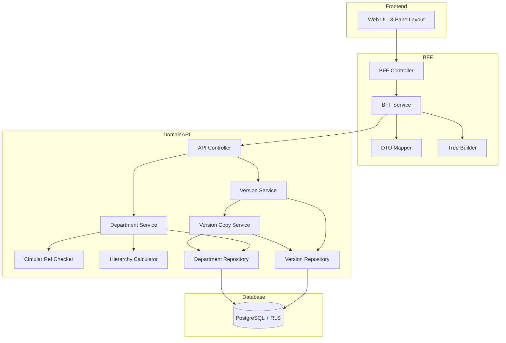
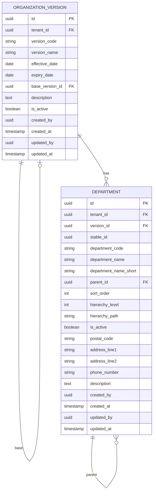

# Technical Design Document

## Feature: master-data/organization-master

---

## Overview

組織マスタは、ProcureERP における「組織バージョン（organization_versions）」と「部門（departments）」を管理する機能である。組織は「版（Version）」としてスナップショット管理され、各版に属する部門は階層構造（ツリー）を持つ。

部門には版内のID（department_id）と版を跨いだ追跡キー（stable_id）が存在する。社員所属/時系列比較では stable_id を使用し、版を跨いだ部門の追跡・比較を可能にする。

本機能の UI は3ペイン構成を採用し、左に組織バージョン履歴カード、中央に部門ツリー、右に詳細パネルという操作フローを提供する。右クリックコンテキストメニューによる部門操作（追加・編集・無効化・移動）を可能にする。部門階層における循環参照は無限ループを引き起こすため、parent_id 変更時には必ず循環参照チェックを実行する。

---

## Architecture

### Architecture Pattern & Boundary Map

**Pattern (fixed)**:
- UI（apps/web） → BFF（apps/bff） → Domain API（apps/api） → DB（PostgreSQL + RLS）
- UI 直 API は禁止



**Contracts (SSoT)**:
- UI ↔ BFF: `packages/contracts/src/bff/organization-master`
- BFF ↔ Domain API: `packages/contracts/src/api/organization-master`
- Enum/Error: `packages/contracts/src/api/errors`
- UI は `packages/contracts/src/api` を参照してはならない

---

## Architecture Responsibilities（Mandatory）

### BFF Specification（apps/bff）

**Purpose**
- UI 要件に最適化した API（Version List + Tree View + Detail Panel 向け）
- Domain API のレスポンスをツリー構造に変換
- ビジネスルールの正本は持たない

**BFF Endpoints（UI が叩く）**

| Method | Endpoint | Purpose | Request DTO (contracts/bff) | Response DTO (contracts/bff) | Notes |
|--------|----------|---------|-----------------------------|-----------------------------|-------|
| GET | /api/bff/master-data/organization-master/versions | バージョン一覧取得 | BffVersionListRequest | BffVersionListResponse | テナントの全バージョン |
| GET | /api/bff/master-data/organization-master/versions/:id | バージョン詳細取得 | - | BffVersionDetailResponse | UUID パス |
| POST | /api/bff/master-data/organization-master/versions | バージョン新規作成 | BffCreateVersionRequest | BffVersionDetailResponse | - |
| POST | /api/bff/master-data/organization-master/versions/:id/copy | バージョンコピー作成 | BffCopyVersionRequest | BffVersionDetailResponse | 部門も全コピー |
| PATCH | /api/bff/master-data/organization-master/versions/:id | バージョン編集 | BffUpdateVersionRequest | BffVersionDetailResponse | 部分更新 |
| GET | /api/bff/master-data/organization-master/versions/as-of | as-of検索 | asOfDate (query) | BffVersionDetailResponse | 日付指定 |
| GET | /api/bff/master-data/organization-master/versions/:versionId/departments/tree | 部門ツリー取得 | BffDepartmentTreeRequest | BffDepartmentTreeResponse | 階層構造 |
| GET | /api/bff/master-data/organization-master/departments/:id | 部門詳細取得 | - | BffDepartmentDetailResponse | UUID パス |
| POST | /api/bff/master-data/organization-master/versions/:versionId/departments | 部門新規登録 | BffCreateDepartmentRequest | BffDepartmentDetailResponse | stable_id自動生成 |
| PATCH | /api/bff/master-data/organization-master/departments/:id | 部門編集 | BffUpdateDepartmentRequest | BffDepartmentDetailResponse | 部分更新 |
| POST | /api/bff/master-data/organization-master/departments/:id/move | 部門移動 | BffMoveDepartmentRequest | BffDepartmentTreeResponse | parent_id変更 |
| POST | /api/bff/master-data/organization-master/departments/:id/deactivate | 部門無効化 | - | BffDepartmentDetailResponse | is_active → false |
| POST | /api/bff/master-data/organization-master/departments/:id/reactivate | 部門再有効化 | - | BffDepartmentDetailResponse | is_active → true |

**Naming Convention（必須）**
- DTO / Contracts: camelCase（例: `versionCode`, `departmentName`）
- DB columns: snake_case（例: `version_code`, `department_name`）
- DB 列名（snake_case）を UI/BFF へ露出させない

**Tree Response 構造（BFF 責務）**
- Domain API からフラットな部門一覧を取得
- BFF でツリー構造（DepartmentTreeNode[]）に変換
- ルートノード = parent_id が NULL の部門
- 子ノード = parent_id で紐づく部門

**Filter Normalization（BFF 責務）**
- keyword: trim、空→undefined
- isActive: boolean | undefined（デフォルト: true）

**sortBy Whitelist（BFF 責務）**
- versions: effectiveDate（default）, versionCode, versionName
- departments: sortOrder（default）, departmentCode, departmentName

**Error Policy（必須）**
- 採用方針：**Option A: Pass-through**
- 採用理由：
  - Domain API のエラーコードは明確で、UI で直接ハンドリング可能
  - 循環参照チェック等のビジネスロジック正本は Domain API

**Error Handling（contracts error に準拠）**

| Domain API Error | HTTP Status | BFF Action |
|-----------------|-------------|------------|
| VERSION_NOT_FOUND | 404 | Pass-through |
| VERSION_CODE_DUPLICATE | 409 | Pass-through |
| INVALID_EFFECTIVE_DATE_RANGE | 422 | Pass-through |
| DEPARTMENT_NOT_FOUND | 404 | Pass-through |
| DEPARTMENT_CODE_DUPLICATE | 409 | Pass-through |
| DEPARTMENT_ALREADY_INACTIVE | 409 | Pass-through |
| DEPARTMENT_ALREADY_ACTIVE | 409 | Pass-through |
| CIRCULAR_REFERENCE_DETECTED | 422 | Pass-through |
| NO_EFFECTIVE_VERSION_FOUND | 404 | Pass-through |
| VALIDATION_ERROR | 422 | Pass-through |

**Authentication / Tenant Context**
- tenant_id / user_id は認証ミドルウェアで解決し、リクエストコンテキストに付与
- Domain API へは `x-tenant-id` / `x-user-id` ヘッダーで伝搬

---

### Service Specification（Domain / apps/api）

**Purpose**
- ビジネスルールの正本（BFF/UI は禁止）
- Transaction boundary / audit points を必ず明記

**Domain API Endpoints - Versions**

| Method | Endpoint | Purpose | Transaction | Audit |
|--------|----------|---------|-------------|-------|
| GET | /api/master-data/organization-master/versions | 一覧取得 | Read-only | - |
| GET | /api/master-data/organization-master/versions/:id | 詳細取得 | Read-only | - |
| POST | /api/master-data/organization-master/versions | 新規登録 | Write（単一） | created_by/at |
| POST | /api/master-data/organization-master/versions/:id/copy | コピー作成 | Write（複数） | created_by/at |
| PATCH | /api/master-data/organization-master/versions/:id | 更新 | Write（単一） | updated_by/at |
| GET | /api/master-data/organization-master/versions/as-of | as-of検索 | Read-only | - |

**Domain API Endpoints - Departments**

| Method | Endpoint | Purpose | Transaction | Audit |
|--------|----------|---------|-------------|-------|
| GET | /api/master-data/organization-master/versions/:versionId/departments | 一覧取得 | Read-only | - |
| GET | /api/master-data/organization-master/departments/:id | 詳細取得 | Read-only | - |
| POST | /api/master-data/organization-master/versions/:versionId/departments | 新規登録 | Write（単一） | created_by/at |
| PATCH | /api/master-data/organization-master/departments/:id | 更新 | Write（単一） | updated_by/at |
| POST | /api/master-data/organization-master/departments/:id/move | 移動 | Write（単一） | updated_by/at |
| POST | /api/master-data/organization-master/departments/:id/deactivate | 無効化 | Write（単一） | updated_by/at |
| POST | /api/master-data/organization-master/departments/:id/reactivate | 再有効化 | Write（単一） | updated_by/at |

**Business Rules（Service 責務）**

*Version Service*
- バージョンコード重複チェック（tenant_id + version_code）
- 有効期間整合性チェック（expiry_date > effective_date）
- as-of検索: effective_date <= 対象日 AND (expiry_date IS NULL OR expiry_date > 対象日)
- 複数該当時は effective_date が最新のものを返す

*Department Service*
- 部門コード重複チェック（tenant_id + version_id + department_code）
- stable_id 自動生成（新規登録時、テナント内一意）
- 循環参照チェック（parent_id 変更時）
- hierarchy_level / hierarchy_path 再計算（登録・移動時）
- 無効化済み部門の再無効化禁止
- 有効部門の再有効化禁止

*Version Copy Service*
- 新バージョン作成 + 全部門コピー（単一トランザクション）
- stable_id を引き継ぎ、新しい department_id を発行
- parent_id を新版内の対応する部門IDに再マッピング
- base_version_id にコピー元バージョンIDを記録

**Circular Reference Check Algorithm**

```typescript
// DFS による循環参照チェック
async checkCircularReference(
  departmentId: string,
  newParentId: string | null,
  allDepartments: Department[]
): Promise<boolean> {
  if (newParentId === null) return false; // ルートへの移動は常に安全
  if (departmentId === newParentId) return true; // 自己参照

  const visited = new Set<string>();
  let current = newParentId;

  while (current !== null) {
    if (current === departmentId) {
      return true; // 循環検出
    }
    if (visited.has(current)) {
      return true; // 既存の循環を検出
    }
    visited.add(current);

    const parent = allDepartments.find(d => d.id === current);
    current = parent?.parentId ?? null;
  }
  return false; // 循環なし
}
```

**Hierarchy Recalculation**

```typescript
// 階層情報の再計算
function recalculateHierarchy(
  department: Department,
  allDepartments: Department[]
): { hierarchyLevel: number; hierarchyPath: string } {
  const path: string[] = [];
  let current = department;
  let level = 1;

  while (current.parentId !== null) {
    const parent = allDepartments.find(d => d.id === current.parentId);
    if (!parent) break;
    path.unshift(parent.departmentCode);
    current = parent;
    level++;
  }

  path.push(department.departmentCode);
  return {
    hierarchyLevel: level,
    hierarchyPath: '/' + path.join('/')
  };
}
```

**Transaction Boundary**
- バージョン CRUD: 単一トランザクション
- バージョンコピー: バージョン作成 + 全部門コピー + parent_id 再マッピングを単一トランザクション
- 部門 CRUD: 単一トランザクション
- 部門移動: parent_id 更新 + hierarchy 再計算を単一トランザクション

---

### Repository Specification（apps/api）

**Purpose**
- データアクセス層（Prisma 経由）
- tenant_id による二重ガード

**Version Repository Methods**

| Method | Parameters | Returns | Notes |
|--------|------------|---------|-------|
| findMany | tenantId, filter | OrganizationVersion[] | フィルタリング対応 |
| findById | tenantId, id | OrganizationVersion \| null | UUID で取得 |
| findByCode | tenantId, versionCode | OrganizationVersion \| null | 重複チェック用 |
| findEffectiveAsOf | tenantId, asOfDate | OrganizationVersion \| null | as-of検索 |
| create | tenantId, data | OrganizationVersion | 監査情報含む |
| update | tenantId, id, data | OrganizationVersion | 監査情報更新 |

**Department Repository Methods**

| Method | Parameters | Returns | Notes |
|--------|------------|---------|-------|
| findByVersion | tenantId, versionId, filter | Department[] | 版内全部門 |
| findById | tenantId, id | Department \| null | UUID で取得 |
| findByCode | tenantId, versionId, departmentCode | Department \| null | 重複チェック用 |
| findByStableId | tenantId, stableId | Department[] | stable_id追跡 |
| create | tenantId, data | Department | stable_id自動生成含む |
| createMany | tenantId, data[] | Department[] | コピー時バルク作成 |
| update | tenantId, id, data | Department | 監査情報更新 |

**Tenant Guard（必須）**
- 全メソッドの第一引数は tenantId
- where 句に必ず tenant_id 条件を含める
- PrismaService.setTenantContext() を呼び出してから Prisma クエリ実行
- RLS 無効化は禁止

---

### Contracts Summary（This Feature）

**BFF Contracts（packages/contracts/src/bff/organization-master）**

```typescript
// === Version DTOs ===

export interface BffVersionListRequest {
  sortBy?: 'effectiveDate' | 'versionCode' | 'versionName';
  sortOrder?: 'asc' | 'desc';
}

export interface BffCreateVersionRequest {
  versionCode: string;
  versionName: string;
  effectiveDate: string;      // ISO 8601
  expiryDate?: string;        // ISO 8601, NULL=無期限
  description?: string;
}

export interface BffCopyVersionRequest {
  versionCode: string;
  versionName: string;
  effectiveDate: string;
  expiryDate?: string;
  description?: string;
}

export interface BffUpdateVersionRequest {
  versionCode?: string;
  versionName?: string;
  effectiveDate?: string;
  expiryDate?: string;
  description?: string;
}

export interface BffVersionSummary {
  id: string;
  versionCode: string;
  versionName: string;
  effectiveDate: string;
  expiryDate: string | null;
  isCurrentlyEffective: boolean;
  departmentCount: number;
}

export interface BffVersionListResponse {
  items: BffVersionSummary[];
}

export interface BffVersionDetailResponse {
  id: string;
  versionCode: string;
  versionName: string;
  effectiveDate: string;
  expiryDate: string | null;
  baseVersionId: string | null;
  description: string | null;
  isCurrentlyEffective: boolean;
  createdAt: string;
  updatedAt: string;
}

// === Department DTOs ===

export interface BffDepartmentTreeRequest {
  keyword?: string;
  isActive?: boolean;        // デフォルト: true（有効のみ表示）
}

export interface BffCreateDepartmentRequest {
  departmentCode: string;     // ユーザー手動入力
  departmentName: string;
  departmentNameShort?: string;
  parentId?: string;           // NULL=ルート部門
  sortOrder?: number;
  postalCode?: string;
  addressLine1?: string;
  addressLine2?: string;
  phoneNumber?: string;
  description?: string;
}

export interface BffUpdateDepartmentRequest {
  departmentCode?: string;
  departmentName?: string;
  departmentNameShort?: string;
  parentId?: string;
  sortOrder?: number;
  postalCode?: string;
  addressLine1?: string;
  addressLine2?: string;
  phoneNumber?: string;
  description?: string;
}

export interface BffMoveDepartmentRequest {
  newParentId: string | null;  // NULL=ルートへ移動
}

export interface BffDepartmentTreeNode {
  id: string;
  departmentCode: string;
  departmentName: string;
  departmentNameShort: string | null;
  isActive: boolean;
  hierarchyLevel: number;
  children: BffDepartmentTreeNode[];
}

export interface BffDepartmentTreeResponse {
  versionId: string;
  versionCode: string;
  nodes: BffDepartmentTreeNode[];
}

export interface BffDepartmentDetailResponse {
  id: string;
  versionId: string;
  stableId: string;
  departmentCode: string;
  departmentName: string;
  departmentNameShort: string | null;
  parentId: string | null;
  parentDepartmentName: string | null;
  sortOrder: number;
  hierarchyLevel: number;
  hierarchyPath: string | null;
  postalCode: string | null;
  addressLine1: string | null;
  addressLine2: string | null;
  phoneNumber: string | null;
  isActive: boolean;
  description: string | null;
  createdAt: string;
  updatedAt: string;
}
```

**API Contracts（packages/contracts/src/api/organization-master）**

```typescript
// === Version DTOs ===

export interface ApiListVersionsRequest {
  sortBy?: 'effective_date' | 'version_code' | 'version_name';
  sortOrder?: 'asc' | 'desc';
}

export interface ApiCreateVersionRequest {
  versionCode: string;
  versionName: string;
  effectiveDate: string;
  expiryDate?: string;
  description?: string;
}

export interface ApiCopyVersionRequest {
  versionCode: string;
  versionName: string;
  effectiveDate: string;
  expiryDate?: string;
  description?: string;
}

export interface ApiUpdateVersionRequest {
  versionCode?: string;
  versionName?: string;
  effectiveDate?: string;
  expiryDate?: string;
  description?: string;
}

export interface ApiVersionResponse {
  id: string;
  versionCode: string;
  versionName: string;
  effectiveDate: string;
  expiryDate: string | null;
  baseVersionId: string | null;
  description: string | null;
  createdAt: string;
  updatedAt: string;
}

export interface ApiListVersionsResponse {
  items: ApiVersionResponse[];
}

// === Department DTOs ===

export interface ApiListDepartmentsRequest {
  keyword?: string;
  isActive?: boolean;
}

export interface ApiCreateDepartmentRequest {
  departmentCode: string;
  departmentName: string;
  departmentNameShort?: string;
  parentId?: string;
  sortOrder?: number;
  postalCode?: string;
  addressLine1?: string;
  addressLine2?: string;
  phoneNumber?: string;
  description?: string;
}

export interface ApiUpdateDepartmentRequest {
  departmentCode?: string;
  departmentName?: string;
  departmentNameShort?: string;
  parentId?: string;
  sortOrder?: number;
  postalCode?: string;
  addressLine1?: string;
  addressLine2?: string;
  phoneNumber?: string;
  description?: string;
}

export interface ApiMoveDepartmentRequest {
  newParentId: string | null;
}

export interface ApiDepartmentResponse {
  id: string;
  versionId: string;
  stableId: string;
  departmentCode: string;
  departmentName: string;
  departmentNameShort: string | null;
  parentId: string | null;
  sortOrder: number;
  hierarchyLevel: number;
  hierarchyPath: string | null;
  postalCode: string | null;
  addressLine1: string | null;
  addressLine2: string | null;
  phoneNumber: string | null;
  isActive: boolean;
  description: string | null;
  createdAt: string;
  updatedAt: string;
}

export interface ApiListDepartmentsResponse {
  items: ApiDepartmentResponse[];
}
```

**Error Contracts（packages/contracts/src/api/errors/organization-master-error.ts）**

```typescript
export const OrganizationMasterErrorCode = {
  VERSION_NOT_FOUND: 'VERSION_NOT_FOUND',
  VERSION_CODE_DUPLICATE: 'VERSION_CODE_DUPLICATE',
  INVALID_EFFECTIVE_DATE_RANGE: 'INVALID_EFFECTIVE_DATE_RANGE',
  NO_EFFECTIVE_VERSION_FOUND: 'NO_EFFECTIVE_VERSION_FOUND',
  DEPARTMENT_NOT_FOUND: 'DEPARTMENT_NOT_FOUND',
  DEPARTMENT_CODE_DUPLICATE: 'DEPARTMENT_CODE_DUPLICATE',
  DEPARTMENT_ALREADY_INACTIVE: 'DEPARTMENT_ALREADY_INACTIVE',
  DEPARTMENT_ALREADY_ACTIVE: 'DEPARTMENT_ALREADY_ACTIVE',
  CIRCULAR_REFERENCE_DETECTED: 'CIRCULAR_REFERENCE_DETECTED',
  VALIDATION_ERROR: 'VALIDATION_ERROR',
} as const;

export type OrganizationMasterErrorCode =
  typeof OrganizationMasterErrorCode[keyof typeof OrganizationMasterErrorCode];

export interface OrganizationMasterError {
  code: OrganizationMasterErrorCode;
  message: string;
  details?: Record<string, unknown>;
}
```

---

## Responsibility Clarification（Mandatory）

本 Feature における責務境界を以下に明記する。
未記載の責務は実装してはならない。

### UI の責務
- バージョン履歴カードのリスト表示・選択（左ペイン）
- 部門ツリーの展開/折りたたみ制御（中央ペイン）
- 右クリックコンテキストメニュー（子部門追加・編集・無効化・移動）
- 詳細パネルのフォーム入力制御・UX 最適化（右ペイン）
- 検索キーワードによるハイライト表示
- フィルタ適用時の親ノード自動展開
- エラーコードに基づく表示切替
- ビジネス判断は禁止

### BFF の責務
- フラットデータ → ツリー構造への変換
- UI 入力の正規化（filtering、keyword trim）
- Domain API DTO ⇄ UI DTO の変換
- isCurrentlyEffective の計算（現在日との比較）
- departmentCount の集計
- parentDepartmentName の結合
- ビジネスルールの正本は持たない

### Domain API の責務
- ビジネスルールの正本
- バージョンコード/部門コード重複チェック
- 有効期間整合性チェック
- stable_id 自動生成
- 循環参照チェック
- hierarchy_level / hierarchy_path 計算
- 無効化/再有効化の状態遷移検証
- バージョンコピー時の部門一括コピー・parent_id再マッピング
- as-of検索ロジック
- 監査ログ・整合性保証
- tenant_id による最終ガード

---

## Data Model

### Entity Reference
- organization_versions: `.kiro/specs/entities/01_組織基盤エンティティ.md` セクション 1
- departments: `.kiro/specs/entities/01_組織基盤エンティティ.md` セクション 2

### エンティティ整合性チェックリスト

| チェック項目 | 確認結果 |
|-------------|---------|
| カラム網羅性 | エンティティ定義の全カラムがDTO/Prismaに反映されている: ✅ |
| 型の一致 | varchar→String, date→DateTime, uuid→String 等の型変換が正確: ✅ |
| 制約の反映 | UNIQUE/CHECK制約がPrisma/アプリ検証に反映: ✅ |
| ビジネスルール | エンティティ補足のルールがServiceに反映: ✅ |
| NULL許可 | NULL/NOT NULLがPrisma?/必須に正しく対応: ✅ |

### ER Diagram



### Prisma Schema - OrganizationVersion

```prisma
model OrganizationVersion {
  id              String    @id @default(uuid())
  tenantId        String    @map("tenant_id")
  versionCode     String    @map("version_code")
  versionName     String    @map("version_name")
  effectiveDate   DateTime  @map("effective_date") @db.Date
  expiryDate      DateTime? @map("expiry_date") @db.Date
  baseVersionId   String?   @map("base_version_id")
  description     String?
  isActive        Boolean   @default(true) @map("is_active")
  createdBy       String?   @map("created_by")
  createdAt       DateTime  @default(now()) @map("created_at")
  updatedBy       String?   @map("updated_by")
  updatedAt       DateTime  @updatedAt @map("updated_at")

  baseVersion     OrganizationVersion?  @relation("VersionCopy", fields: [baseVersionId], references: [id])
  copiedVersions  OrganizationVersion[] @relation("VersionCopy")
  departments     Department[]

  @@unique([tenantId, versionCode])
  @@index([tenantId])
  @@index([tenantId, effectiveDate])
  @@map("organization_versions")
}
```

### Prisma Schema - Department

```prisma
model Department {
  id                  String    @id @default(uuid())
  tenantId            String    @map("tenant_id")
  versionId           String    @map("version_id")
  stableId            String    @map("stable_id")
  departmentCode      String    @map("department_code")
  departmentName      String    @map("department_name")
  departmentNameShort String?   @map("department_name_short")
  parentId            String?   @map("parent_id")
  sortOrder           Int       @default(0) @map("sort_order")
  hierarchyLevel      Int       @default(1) @map("hierarchy_level")
  hierarchyPath       String?   @map("hierarchy_path")
  isActive            Boolean   @default(true) @map("is_active")
  postalCode          String?   @map("postal_code")
  addressLine1        String?   @map("address_line1")
  addressLine2        String?   @map("address_line2")
  phoneNumber         String?   @map("phone_number")
  description         String?
  createdBy           String?   @map("created_by")
  createdAt           DateTime  @default(now()) @map("created_at")
  updatedBy           String?   @map("updated_by")
  updatedAt           DateTime  @updatedAt @map("updated_at")

  version             OrganizationVersion @relation(fields: [tenantId, versionId], references: [tenantId, id])
  parent              Department?         @relation("DepartmentHierarchy", fields: [tenantId, versionId, parentId], references: [tenantId, versionId, id])
  children            Department[]        @relation("DepartmentHierarchy")

  @@unique([tenantId, versionId, departmentCode])
  @@unique([tenantId, versionId, id])
  @@unique([tenantId, stableId])
  @@index([tenantId, versionId])
  @@index([tenantId, versionId, parentId])
  @@index([tenantId, stableId])
  @@map("departments")
}
```

### Constraints

**OrganizationVersion**
- PK: id（UUID）
- UNIQUE: tenant_id + version_code
- CHECK: expiry_date IS NULL OR expiry_date > effective_date（アプリケーション層で検証）

**Department**
- PK: id（UUID）
- UNIQUE: tenant_id + version_id + department_code
- UNIQUE: tenant_id + version_id + id（複合FK用）
- UNIQUE: tenant_id + stable_id
- FK: (tenant_id, version_id) → organization_versions(tenant_id, id)
- FK: (tenant_id, version_id, parent_id) → departments(tenant_id, version_id, id)
- cycle check（アプリケーション層で検証）

### RLS Policy（PostgreSQL）

```sql
-- organization_versions RLS 有効化
ALTER TABLE organization_versions ENABLE ROW LEVEL SECURITY;

CREATE POLICY tenant_isolation ON organization_versions
  USING (tenant_id::text = current_setting('app.current_tenant_id', true));

-- departments RLS 有効化
ALTER TABLE departments ENABLE ROW LEVEL SECURITY;

CREATE POLICY tenant_isolation ON departments
  USING (tenant_id::text = current_setting('app.current_tenant_id', true));
```

---

## Requirements Traceability

| Requirement | Summary | Components | Interfaces | Flows |
|-------------|---------|------------|------------|-------|
| 1.1 | バージョン一覧取得 | VersionRepository.findMany | GET /versions | List |
| 1.2 | 一覧表示項目 | BffVersionSummary | - | List |
| 1.3 | ソート | BFF normalize | sortBy, sortOrder | List |
| 1.4 | 現在有効バージョン表示 | BFF.isCurrentlyEffective | - | List |
| 2.1 | バージョン新規作成 | VersionService.create | POST /versions | Create |
| 2.2 | 作成後詳細返却 | Controller | BffVersionDetailResponse | Create |
| 2.3 | コード重複エラー | VersionService | VERSION_CODE_DUPLICATE | Error |
| 2.4 | 有効期間エラー | VersionService | INVALID_EFFECTIVE_DATE_RANGE | Error |
| 2.5 | 登録監査情報 | Repository | created_by/at | Create |
| 3.1 | コピー作成 | CopyService | POST /:id/copy | Copy |
| 3.2 | stable_id引継 | CopyService | - | Copy |
| 3.3 | parent_id再マッピング | CopyService | - | Copy |
| 3.4 | base_version_id記録 | CopyService | - | Copy |
| 3.5 | コピー元不存在エラー | VersionService | VERSION_NOT_FOUND | Error |
| 4.1 | バージョン編集 | VersionService.update | PATCH /:id | Update |
| 4.2 | 更新後詳細返却 | Controller | BffVersionDetailResponse | Update |
| 4.3 | 対象不存在エラー | VersionService | VERSION_NOT_FOUND | Error |
| 4.4 | コード重複エラー | VersionService | VERSION_CODE_DUPLICATE | Error |
| 4.5 | 更新監査情報 | Repository | updated_by/at | Update |
| 5.1 | 部門ツリー取得 | DepartmentRepository.findByVersion | GET /tree | Tree |
| 5.2 | 親子関係表示 | TreeBuilder | - | Tree |
| 5.3 | ツリー展開 | UI | - | UI |
| 5.4 | ツリー折りたたみ | UI | - | UI |
| 5.5 | ノード情報表示 | BffDepartmentTreeNode | - | Tree |
| 5.6 | ルートノード表示 | TreeBuilder | parentId=null | Tree |
| 5.7 | デフォルト有効のみ | BFF normalize | isActive=true | Filter |
| 6.1 | 詳細パネル表示 | DepartmentRepository.findById | GET /departments/:id | Detail |
| 6.2 | 詳細表示項目 | BffDepartmentDetailResponse | - | Detail |
| 6.3 | 編集モード切替 | UI | - | UI |
| 6.4 | 編集内容保存 | DepartmentService.update | PATCH /departments/:id | Update |
| 6.5 | コード重複エラー | DepartmentService | DEPARTMENT_CODE_DUPLICATE | Error |
| 6.6 | 更新監査情報 | Repository | updated_by/at | Update |
| 6.7 | hierarchy再計算 | HierarchyCalculator | - | Update |
| 7.1 | 部門新規登録 | DepartmentService.create | POST /departments | Create |
| 7.2 | 作成後詳細返却 | Controller | BffDepartmentDetailResponse | Create |
| 7.3 | stable_id自動生成 | DepartmentService | - | Create |
| 7.4 | コード重複エラー | DepartmentService | DEPARTMENT_CODE_DUPLICATE | Error |
| 7.5 | isActive初期化 | DepartmentService | - | Create |
| 7.6 | hierarchy計算 | HierarchyCalculator | - | Create |
| 7.7 | 登録監査情報 | Repository | created_by/at | Create |
| 7.8 | 部門コード手動入力 | UI | - | UI |
| 8.1 | コンテキストメニュー表示 | UI | - | UI |
| 8.2 | 子部門追加 | UI | - | UI |
| 8.3 | 編集選択 | UI | - | UI |
| 8.4 | 無効化選択 | UI | - | UI |
| 8.5 | 移動選択 | UI | - | UI |
| 9.1 | 部門無効化 | DepartmentService.deactivate | POST /:id/deactivate | Deactivate |
| 9.2 | 無効化後詳細返却 | Controller | BffDepartmentDetailResponse | Deactivate |
| 9.3 | 対象不存在エラー | DepartmentService | DEPARTMENT_NOT_FOUND | Error |
| 9.4 | 既無効化エラー | DepartmentService | DEPARTMENT_ALREADY_INACTIVE | Error |
| 9.5 | 無効化監査情報 | Repository | updated_by/at | Deactivate |
| 10.1 | 部門再有効化 | DepartmentService.reactivate | POST /:id/reactivate | Reactivate |
| 10.2 | 再有効化後詳細返却 | Controller | BffDepartmentDetailResponse | Reactivate |
| 10.3 | 対象不存在エラー | DepartmentService | DEPARTMENT_NOT_FOUND | Error |
| 10.4 | 既有効エラー | DepartmentService | DEPARTMENT_ALREADY_ACTIVE | Error |
| 10.5 | 再有効化監査情報 | Repository | updated_by/at | Reactivate |
| 11.1 | キーワード検索 | BFF.normalize, Repository | keyword | Filter |
| 11.2 | 有効フラグフィルタ | Repository | isActive | Filter |
| 11.3 | AND結合 | Repository | - | Filter |
| 11.4 | 親ノード自動展開 | TreeBuilder | - | Tree |
| 11.5 | デフォルト有効のみ | BFF normalize | isActive=true | Filter |
| 12.1 | 循環参照チェック | CircularRefChecker | - | Validation |
| 12.2 | 循環検出エラー | DepartmentService | CIRCULAR_REFERENCE_DETECTED | Error |
| 12.3 | 移動時循環チェック | CircularRefChecker | - | Validation |
| 12.4 | DFS/BFSアルゴリズム | CircularRefChecker | - | Algorithm |
| 12.5 | 循環時ロールバック | Transaction | - | Error |
| 13.1 | tenant_idフィルタ | Repository | where tenant_id | All |
| 13.2 | Repository必須引数 | Repository signature | tenantId first arg | All |
| 13.3 | RLS double-guard | PrismaService.setTenantContext | - | All |
| 13.4 | 異テナントアクセス拒否 | RLS Policy | - | Security |
| 14.1 | バージョン複合一意制約 | Prisma @@unique | - | DB |
| 14.2 | 部門複合一意制約 | Prisma @@unique | - | DB |
| 14.3 | stable_id一意制約 | Prisma @@unique | - | DB |
| 14.4 | 重複エラー | Service | *_DUPLICATE | Error |
| 15.1 | 操作ユーザーID記録 | Repository | created_by/updated_by | Audit |
| 15.2 | 操作日時記録 | Prisma @default(now) | created_at/updated_at | Audit |
| 15.3 | 監査情報自動記録 | Prisma @updatedAt | - | Audit |
| 16.1 | as-of検索 | VersionRepository.findEffectiveAsOf | GET /as-of | AsOf |
| 16.2 | 複数該当時の処理 | VersionService | effective_date DESC | AsOf |
| 16.3 | 該当なしメッセージ | VersionService | NO_EFFECTIVE_VERSION_FOUND | AsOf |

---

## Component Summary

| Component | Domain | Intent | Requirements | Dependencies |
|-----------|--------|--------|--------------|--------------|
| OrganizationMasterController (API) | Domain API | REST エンドポイント提供 | All | VersionService, DepartmentService |
| VersionService | Domain API | バージョンビジネスルール実行 | 1-4, 16 | VersionRepository, CopyService |
| VersionCopyService | Domain API | コピー作成ロジック | 3 | VersionRepository, DepartmentRepository |
| DepartmentService | Domain API | 部門ビジネスルール実行 | 5-12 | DepartmentRepository, CircularRefChecker, HierarchyCalculator |
| CircularRefChecker | Domain API | 循環参照チェック | 12 | - |
| HierarchyCalculator | Domain API | 階層情報計算 | 6.7, 7.6 | - |
| VersionRepository | Domain API | バージョンデータアクセス | 13, 14, 15 | PrismaService |
| DepartmentRepository | Domain API | 部門データアクセス | 13, 14, 15 | PrismaService |
| OrganizationMasterController (BFF) | BFF | UI向けエンドポイント | All | BffService |
| OrganizationMasterService (BFF) | BFF | DTO変換・ツリー構築 | 1, 5, 11 | Mapper, TreeBuilder, ApiClient |
| DepartmentTreeBuilder | BFF | ツリー構造構築 | 5 | - |
| OrganizationMapper | BFF | DTO変換 | - | - |

---

## Technology Stack & Alignment

| Layer | Technology | Version | Role |
|-------|------------|---------|------|
| Frontend | Next.js (App Router) | 14.x | UI ホスティング |
| Frontend | React | 18.x | UI コンポーネント |
| Frontend | TypeScript | 5.x | 型安全性 |
| Frontend | TanStack Query | 5.x | Server State 管理 |
| Frontend | dnd-kit | latest | ドラッグ＆ドロップ |
| BFF | NestJS | 10.x | BFF フレームワーク |
| Backend | NestJS | 10.x | Domain API フレームワーク |
| Backend | TypeScript | 5.x | 型安全性 |
| Backend | Prisma | 5.x | ORM |
| Database | PostgreSQL | 15.x | RDBMS + RLS |
| Contracts | TypeScript | 5.x | 型定義 SSoT |

---

## Security Considerations

- **マルチテナント分離**: tenant_id による RLS + アプリケーションガード（double-guard）
- **認証**: Clerk 経由で認証済みユーザーのみアクセス可
- **認可**: 本機能では権限チェックは実装対象外（将来拡張）
- **入力検証**:
  - versionCode: 最大 20 文字
  - versionName: 最大 200 文字
  - departmentCode: 最大 50 文字、英数字・ハイフン許可
  - departmentName: 最大 200 文字

---

## Testing Strategy

| Test Type | Scope | Tools | Coverage Target |
|-----------|-------|-------|-----------------|
| Unit | VersionService | Jest | ビジネスロジック 100% |
| Unit | DepartmentService | Jest | ビジネスロジック 100% |
| Unit | CircularRefChecker | Jest | 全パターン網羅 |
| Unit | HierarchyCalculator | Jest | 計算ロジック 100% |
| Unit | TreeBuilder | Jest | 変換ロジック 100% |
| Integration | Repository + DB | Jest + Testcontainers | CRUD + RLS |
| E2E | UI → BFF → API → DB | Playwright | 主要シナリオ |

**循環参照テストケース（必須）**
- 直接循環: A の親を A に設定
- 間接循環: A → B → C、C の親を A に設定
- 深い循環: A → B → C → D → E、E の親を A に設定
- ルート移動: 常に安全

**コピー作成テストケース（必須）**
- 空バージョンのコピー
- 部門ありバージョンのコピー
- 階層構造を持つ部門のコピー（parent_id 再マッピング確認）
- stable_id 引継ぎ確認

---

## Open Questions / Risks

- **Q1**: 部門コードの形式制約は？
  - **Decision**: 英数字・ハイフン・アンダースコアのみ、最大 50 文字
- **Q2**: 部門ツリー全件取得のパフォーマンスは？
  - **Decision**: 初期は全件取得、1000 件超で遅延読み込み検討
- **Q3**: stable_id の生成方法は？
  - **Decision**: UUID v4 を自動生成、テナント内で一意を保証
- **Risk**: 大量部門（1000 件超）でのツリー表示性能
  - **Mitigation**: 遅延展開、仮想スクロール検討
- **Risk**: コピー作成時の大量部門処理
  - **Mitigation**: バルクインサート使用、トランザクションタイムアウト設定

---

## References

- [requirements.md](./requirements.md) — 要件定義
- `.kiro/specs/entities/01_組織基盤エンティティ.md` — エンティティ定義（セクション 1, 2）
- `.kiro/steering/tech.md` — 技術憲法
- `.kiro/steering/structure.md` — 構造憲法
