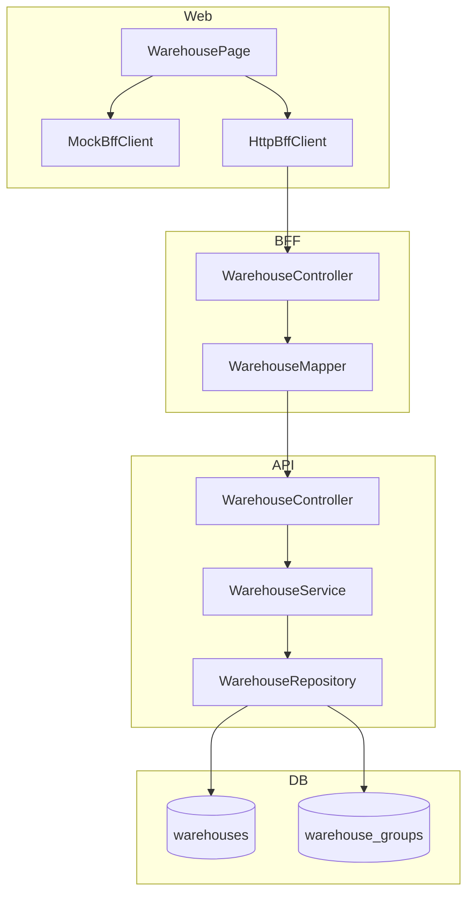
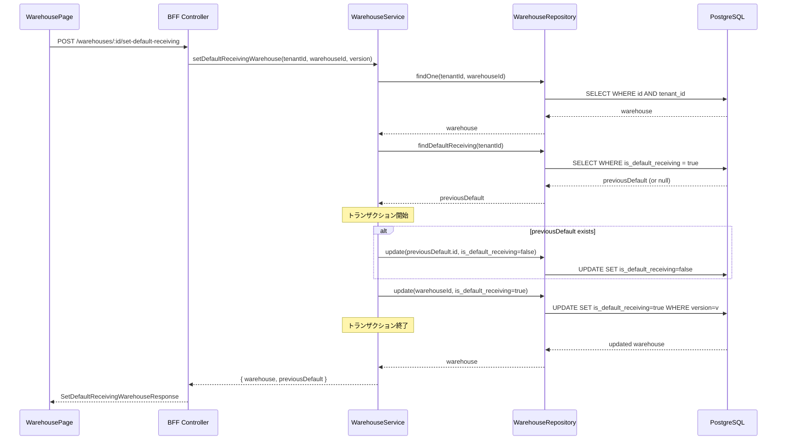

# Technical Design: 倉庫マスタ (Warehouse Master)

---

## Overview

倉庫マスタは、ProcureERP における自社の受入・保管場所（倉庫）を管理するマスタ機能である。
発注・入荷時に受入倉庫を指定するための基盤マスタとして機能し、将来の在庫管理（V2以降）の基盤となる。

本機能は bank-master、organization-master と同様の CRUD パターンに従い、既存の実装パターンを踏襲する。
倉庫グループ（WarehouseGroup）は MVP ではエンティティのみ作成し、UI 実装は V2 以降とする。

---

## Architecture

### Architecture Pattern & Boundary Map

**Pattern (fixed)**:
- UI（apps/web） → BFF（apps/bff） → Domain API（apps/api） → DB（PostgreSQL + RLS）
- UI直APIは禁止

**Contracts (SSoT)**:
- UI ↔ BFF: `packages/contracts/src/bff/warehouse`
- BFF ↔ Domain API: `packages/contracts/src/api/warehouse`
- Error: `packages/contracts/src/api/errors/warehouse-error.ts`, `packages/contracts/src/bff/errors/warehouse-error.ts`
- UI は `packages/contracts/src/api` を参照してはならない



---

## Architecture Responsibilities（Mandatory）

### BFF Specification（apps/bff）

**Purpose**
- UI要件に最適化した倉庫マスタAPI（Read Model / ViewModel）
- Domain APIのレスポンスを集約・変換（ビジネスルールの正本は持たない）

**BFF Endpoints（UIが叩く）**

| Method | Endpoint | Purpose | Request DTO | Response DTO | Notes |
|--------|----------|---------|-------------|--------------|-------|
| GET | /api/bff/master-data/warehouses | 一覧取得 | ListWarehousesRequest | ListWarehousesResponse | カナ検索対応 |
| GET | /api/bff/master-data/warehouses/:id | 詳細取得 | - | GetWarehouseResponse | |
| POST | /api/bff/master-data/warehouses | 新規登録 | CreateWarehouseRequest | CreateWarehouseResponse | |
| PUT | /api/bff/master-data/warehouses/:id | 更新 | UpdateWarehouseRequest | UpdateWarehouseResponse | 楽観ロック |
| POST | /api/bff/master-data/warehouses/:id/deactivate | 無効化 | DeactivateWarehouseRequest | DeactivateWarehouseResponse | 既定受入倉庫は無効化不可 |
| POST | /api/bff/master-data/warehouses/:id/activate | 有効化 | ActivateWarehouseRequest | ActivateWarehouseResponse | |
| POST | /api/bff/master-data/warehouses/:id/set-default-receiving | 既定設定 | SetDefaultReceivingWarehouseRequest | SetDefaultReceivingWarehouseResponse | 既存既定を自動解除 |

**Naming Convention（必須）**
- DTO / Contracts: camelCase（例: `warehouseCode`, `warehouseName`）
- DB columns: snake_case（例: `warehouse_code`, `warehouse_name`）
- `sortBy` は **DTO側キー**を採用する（`warehouseCode` | `warehouseName` | `warehouseNameKana` | `displayOrder` | `isActive`）
- DB列名（snake_case）を UI/BFF へ露出させない

**Paging / Sorting Normalization（必須・BFF責務）**
- UI/BFF: page / pageSize（page-based）
- Domain API: offset / limit（DB-friendly）
- BFFは必ず以下を実施する（省略禁止）：
  - defaults: page=1, pageSize=20, sortBy=displayOrder, sortOrder=asc
  - clamp: pageSize <= 200
  - whitelist: sortBy は `warehouseCode` | `warehouseName` | `warehouseNameKana` | `displayOrder` | `isActive` のみ許可
  - normalize: keyword trim、空→undefined
  - transform: offset=(page-1)*pageSize, limit=pageSize
- Domain APIに渡すのは offset/limit（page/pageSizeは渡さない）
- BFFレスポンスには page/pageSize/totalPages を含める（UIへ返すのはBFF側の値）

**Transformation Rules（api DTO → bff DTO）**

| API Field | BFF Field | Transformation |
|-----------|-----------|----------------|
| WarehouseApiDto | WarehouseDto | 直接マッピング（フィールド同一） |
| total | total, totalPages | totalPages = Math.ceil(total / pageSize) |

**Error Handling（contracts errorに準拠）**

**Error Policy（必須・未記載禁止）**
- この Feature における BFF の Error Policy は以下とする：
  - 採用方針：**Option A: Pass-through**
  - 採用理由：倉庫マスタは標準的なCRUD操作であり、Domain APIのエラーをそのままUIに透過する。BFF側での意味的な再分類・書き換えは不要。

**Error Codes（contracts/bff/errors/warehouse-error.ts）**

| Code | HTTP Status | Description |
|------|-------------|-------------|
| WAREHOUSE_NOT_FOUND | 404 | 指定された倉庫が見つからない |
| WAREHOUSE_CODE_DUPLICATE | 409 | 倉庫コードが既に使用されている |
| INVALID_WAREHOUSE_CODE_FORMAT | 422 | 倉庫コードの形式が不正 |
| INVALID_WAREHOUSE_CODE_LENGTH | 422 | 倉庫コードは10文字以内である必要がある |
| INVALID_WAREHOUSE_CODE_CHARS | 422 | 倉庫コードは半角英数字のみ使用可能 |
| WAREHOUSE_GROUP_NOT_FOUND | 404 | 指定された倉庫グループが見つからない |
| DEFAULT_RECEIVING_ALREADY_SET | 409 | 既定受入倉庫は既に設定されている |
| CANNOT_DEACTIVATE_DEFAULT_RECEIVING | 422 | 既定受入倉庫を無効化することはできない |
| CONCURRENT_UPDATE | 409 | 他のユーザーによりデータが更新された |

**Authentication / Tenant Context（tenant_id/user_id伝搬）**
- tenant_id/user_id は BFF で認証情報（Clerk JWT）から解決
- Domain APIへは Header経由で伝搬（`x-tenant-id`, `x-user-id`）

---

### Service Specification（Domain / apps/api）

**Purpose**
- 倉庫マスタのビジネスルールの正本
- Transaction boundary / audit points を管理

**Service Methods**

```typescript
// WarehouseService
interface WarehouseService {
  // 一覧取得
  listWarehouses(params: {
    tenantId: string;
    offset: number;
    limit: number;
    sortBy?: WarehouseSortBy;
    sortOrder?: SortOrder;
    keyword?: string;
    isActive?: boolean;
  }): Promise<{ items: WarehouseApiDto[]; total: number }>;

  // 詳細取得
  getWarehouse(params: {
    tenantId: string;
    warehouseId: string;
  }): Promise<WarehouseApiDto>;

  // 新規登録
  createWarehouse(params: {
    tenantId: string;
    userId: string;
    data: CreateWarehouseApiRequest;
  }): Promise<WarehouseApiDto>;

  // 更新
  updateWarehouse(params: {
    tenantId: string;
    userId: string;
    warehouseId: string;
    data: UpdateWarehouseApiRequest;
  }): Promise<WarehouseApiDto>;

  // 無効化
  deactivateWarehouse(params: {
    tenantId: string;
    userId: string;
    warehouseId: string;
    version: number;
  }): Promise<WarehouseApiDto>;

  // 有効化
  activateWarehouse(params: {
    tenantId: string;
    userId: string;
    warehouseId: string;
    version: number;
  }): Promise<WarehouseApiDto>;

  // 既定受入倉庫設定
  setDefaultReceivingWarehouse(params: {
    tenantId: string;
    userId: string;
    warehouseId: string;
    version: number;
  }): Promise<{
    warehouse: WarehouseApiDto;
    previousDefault: WarehouseApiDto | null;
  }>;
}
```

**Business Rules（Domain API責務）**
- 倉庫コードは登録後変更不可
- 倉庫コードはテナント内で一意
- 倉庫コードは半角英数字10文字以内
- 既定受入倉庫はテナントにつき1倉庫のみ
- 既定受入倉庫の無効化は禁止（先に別の倉庫を既定に設定必要）
- 楽観ロック（version照合）による競合制御

**Transaction Boundaries**
- 既定受入倉庫設定時：既存既定の解除と新規既定の設定を1トランザクションで実行

**Audit Points**
- 倉庫の作成・更新・無効化・有効化時に監査情報（created_by, updated_by, timestamps）を記録

---

### Repository Specification（apps/api）

**Repository Pattern**
- tenant_id 必須（全メソッド）
- where句二重ガード必須
- set_config 前提（RLS無効化禁止）

```typescript
// WarehouseRepository
interface WarehouseRepository {
  findMany(params: {
    tenantId: string;
    offset: number;
    limit: number;
    sortBy?: WarehouseSortBy;
    sortOrder?: SortOrder;
    keyword?: string;
    isActive?: boolean;
  }): Promise<{ items: Warehouse[]; total: number }>;

  findOne(params: {
    tenantId: string;
    warehouseId: string;
  }): Promise<Warehouse | null>;

  findByCode(params: {
    tenantId: string;
    warehouseCode: string;
  }): Promise<Warehouse | null>;

  findDefaultReceiving(params: {
    tenantId: string;
  }): Promise<Warehouse | null>;

  create(params: {
    tenantId: string;
    createdBy: string;
    data: CreateWarehouseData;
  }): Promise<Warehouse>;

  update(params: {
    tenantId: string;
    warehouseId: string;
    version: number;
    updatedBy: string;
    data: UpdateWarehouseData;
  }): Promise<Warehouse | null>;

  setDefaultReceiving(params: {
    tenantId: string;
    warehouseId: string;
    version: number;
    updatedBy: string;
  }): Promise<{
    updated: Warehouse | null;
    previousDefault: Warehouse | null;
  }>;

  checkCodeDuplicate(params: {
    tenantId: string;
    warehouseCode: string;
    excludeWarehouseId?: string;
  }): Promise<boolean>;
}
```

---

### Contracts Summary（This Feature）

| Contract Type | Location | Description |
|---------------|----------|-------------|
| API DTO | `packages/contracts/src/api/warehouse/index.ts` | BFF ↔ Domain API 契約 |
| BFF DTO | `packages/contracts/src/bff/warehouse/index.ts` | UI ↔ BFF 契約 |
| API Error | `packages/contracts/src/api/errors/warehouse-error.ts` | Domain API エラー定義 |
| BFF Error | `packages/contracts/src/bff/errors/warehouse-error.ts` | BFF エラー定義（Pass-through） |

- DTO / Error / Enum は contracts 外に定義してはならない
- UIは bff のみ参照

---

## Responsibility Clarification（Mandatory）

本Featureにおける責務境界を以下に明記する。
未記載の責務は実装してはならない。

### UIの責務
- 倉庫一覧の表示・検索・ソート制御
- 倉庫登録・編集フォームの表示制御
- 既定受入倉庫フラグの表示・設定UI
- ビジネス判断は禁止（既定受入倉庫の一意性判断など）

### BFFの責務
- UI入力の正規化（paging / sorting / filtering）
  - page/pageSize → offset/limit 変換
  - sortBy whitelist 検証
  - keyword trim/undefined化
- Domain API DTO ⇄ UI DTO の変換
- ビジネスルールの正本は持たない
- Error は Pass-through（Domain APIエラーをそのまま返却）

### Domain APIの責務
- ビジネスルールの正本
  - 倉庫コードのバリデーション（形式・長さ・文字種・重複）
  - 既定受入倉庫の一意性保証
  - 既定受入倉庫の無効化禁止
- 権限・状態遷移の最終判断
- 監査ログ・整合性保証
  - 楽観ロック（version）による競合制御
  - 監査列（created_by, updated_by, timestamps）の記録

---

## Requirements Traceability

| Requirement | Summary | Components | Interfaces | Notes |
|-------------|---------|------------|------------|-------|
| 1.1-1.4 | 倉庫一覧表示 | UI:WarehousePage, BFF:Controller, API:Service,Repository | ListWarehouses | カナ検索・ソート対応 |
| 2.1-2.6 | 倉庫登録 | UI:WarehouseDialog, BFF:Controller, API:Service,Repository | CreateWarehouse | 住所分割形式・カナ正規化 |
| 3.1-3.4 | 倉庫編集 | UI:WarehouseDialog, BFF:Controller, API:Service,Repository | UpdateWarehouse | 楽観ロック |
| 4.1-4.4 | 倉庫無効化 | UI:WarehousePage, BFF:Controller, API:Service | DeactivateWarehouse | 既定受入倉庫は無効化不可 |
| 5.1-5.5 | 既定受入倉庫設定 | UI:WarehousePage, API:Service,Repository | SetDefaultReceivingWarehouse | 既存既定自動解除 |
| 6.1-6.7 | 入力バリデーション | API:Service | All mutations | コード形式・重複チェック |
| 7.1-7.3 | テナント分離 | API:Repository | All | RLS + tenant_id double-guard |

---

## Data Model

### Entity: Warehouse

```
warehouses (table)
├─ id                      : uuid (PK)
├─ tenant_id               : uuid (FK → tenants, RLS)
├─ warehouse_code          : varchar(10) (UNIQUE per tenant)
├─ warehouse_name          : varchar(100)
├─ warehouse_name_kana     : varchar(200) (nullable, 半角カナ)
├─ warehouse_group_id      : uuid (FK → warehouse_groups, nullable)
├─ postal_code             : varchar(10) (nullable)
├─ prefecture              : varchar(20) (nullable)
├─ city                    : varchar(50) (nullable)
├─ address_1               : varchar(100) (nullable)
├─ address_2               : varchar(100) (nullable)
├─ phone_number            : varchar(20) (nullable)
├─ is_default_receiving    : boolean (default: false)
├─ display_order           : integer (default: 1000)
├─ notes                   : text (nullable)
├─ is_active               : boolean (default: true)
├─ version                 : integer (default: 1, 楽観ロック)
├─ created_at              : timestamptz
├─ created_by_login_account_id : uuid (FK → login_accounts, nullable)
├─ updated_at              : timestamptz
└─ updated_by_login_account_id : uuid (FK → login_accounts, nullable)
```

**Constraints**
- UNIQUE(tenant_id, warehouse_code)
- 部分一意制約: UNIQUE(tenant_id) WHERE is_default_receiving = true AND is_active = true
- FK(warehouse_group_id) → warehouse_groups(id)

### Entity: WarehouseGroup（MVP: エンティティのみ）

```
warehouse_groups (table)
├─ id                      : uuid (PK)
├─ tenant_id               : uuid (FK → tenants, RLS)
├─ warehouse_group_code    : varchar(10) (UNIQUE per tenant)
├─ warehouse_group_name    : varchar(100)
├─ notes                   : text (nullable)
├─ is_active               : boolean (default: true)
├─ version                 : integer (default: 1)
├─ created_at              : timestamptz
├─ created_by_login_account_id : uuid (nullable)
├─ updated_at              : timestamptz
└─ updated_by_login_account_id : uuid (nullable)
```

---

## System Flows

### 既定受入倉庫設定フロー



---

## UI Components（Summary）

| Component | Domain | Intent | Requirements |
|-----------|--------|--------|--------------|
| WarehousePage | master-data/warehouse | 一覧画面・検索・操作 | 1.1-1.4, 4.1-4.4, 5.1-5.5 |
| WarehouseDialog | master-data/warehouse | 登録・編集ダイアログ | 2.1-2.6, 3.1-3.4, 6.1-6.7 |
| WarehouseList | master-data/warehouse | 一覧表示テーブル | 1.1-1.4 |
| BffClient / MockBffClient / HttpBffClient | shared/api | API呼び出し抽象化 | - |

**Implementation Notes**
- Phase 1（UI-MOCK）では MockBffClient で動作確認
- Phase 2（UI-BFF）で HttpBffClient に差し替え
- 既存の bank-master, ship-to UI パターンを踏襲

---

## Non-Functional Requirements

### NFR-1: パフォーマンス
- 倉庫一覧検索は 100件以下で 500ms 以内に応答
- カナ検索は入力後 200ms 以内に結果を返す（デバウンス処理適用）

### NFR-2: データ保持
- 物理削除は行わず、論理削除（is_active = false）で履歴を保持
- 監査列により作成・更新の追跡が可能

---

## References

- 仕様概要: `.kiro/specs/spec_doc/61_機能設計検討/01_仕様検討/04_共通・銀行・倉庫 仕様概要.md`
- エンティティ定義: `.kiro/specs/spec_doc/61_機能設計検討/02_エンティティ定義/04_共通・銀行・倉庫.md`
- 要件: `.kiro/specs/master-data/warehouse/requirements.md`
- API契約: `packages/contracts/src/api/warehouse/index.ts`
- BFF契約: `packages/contracts/src/bff/warehouse/index.ts`
- 既存パターン: `apps/api/src/modules/master-data/bank-master/`
